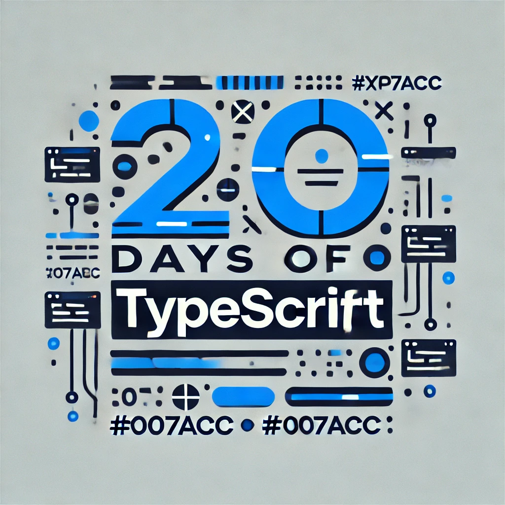

<div align="center"> 
  <h1>20 Days of Basics TypeScript: Introduction </h1>
</div>

<div align="center"> 

<!-- Social links -->
[](htttps://discord.gg/Samson#0273) [](https://www.facebook.com/chiemezie.nebeolisa/) [](https://www.instagram.com/samson_nebeolisa/) [](https://www.linkedin.com/in/chiemezie-samson-nebeolisa-32897310b/) [](https://stackoverflow.com/users/20653301/nebeolisa-chiemezie-samson) [](https://twitter.com/SamsonChiemezie) [](https://myaccount.google.com/u/0/?utm_source=YouTubeWeb&tab=rk&utm_medium=act&tab=rk&hl=en) 

<!-- Portfolio -->
 📰 About Me [Portfolio](https://www.nebe-samson.com/)
 <br/>
  <small>Sep, 2024</small>
</div>


|       # Day       |                               Topics                                    |
|:-----------------:| :----------------------------------------------------------------------:|
|         00        |                   [Introduction](./README.md#-day-0)                    |
|         01        |  [TypeScript Introduction](./src/Day1_TypeScript_Introduction/Day1.md)  |
|         02        |            [Types in TypeScript](./src/Day2_Types/Day2.md)              |
|         03        |         [Arrays in TypeScript](./src/Day3_Array_Type/Day3.md)           |
|         04        |         [Tuple Types in TypeScript](./src/Day4_Tuple/Day4.md)           |
|         05        |        [Object Types in TypeScript](./src/Day5_Objects/Day5.md)         |
|         06        |       [Functions in TypeScript 1](./src/Day6_Functions_1/Day6.md)       |
|         07        |       [Functions in TypeScript 2](./src/Day7_Functions_2/Day7.md)       |
|         08        |         [Narrowing in TypeScript](./src/Day8_Narrowing/Day8.md)         |
|         09        |        [Type Manipulation](./src/Day9_Type_Manipulation/Day9.md)        |
|         10        |      [Conditional Types](./src/Day10_Conditional_Types/Day10.md)        |
|         11        |            [Mapped Types](./src/Day11_Mapped_Types/Day11.md)            |
|         12        |  [Template Literal Types](./src/Day12_Template_Literal_Types/Day12.md)  |
|         13        |              [Classes 1](./src/Day13_Classes_1/Day13.md)                |
|         14        |              [Classes 2](./src/Day14_Classes_2/Day14.md)                |
|         15        |                [Modules](./src/Day15_Modules/Day15.md)                  |
|         16        |          [Utility Types](./src/Day16_Utility_Types/Day16.md)            |
|         17        |                   [Enums](./src/Day17_Enums/Day17.md)                   |
|         18        |       [DOM Manipulation](./src/Day18_DOM_Manipulation/Day18.md)         |
|         19        |           [DOM Practice](./src/Day19_Dom_Practice/Day19.md)             |
|         20        |         [Final Projects](./src/Day20_Final_Project/Day20.md)            |


[Day 1 >>](./src/Day1_TypeScript_Introduction/Day1.md)

<div align="center"> 
  <a class="header-image" target="_blank" href="./src/Asset/images/Days/Day_0.webp">
    
  </a>
</div>

## Table of Contents

- [📔 Day 0](#-day-0)
  - [Introduction](#introduction)
    - [Self Introduction](#self-introduction)
    - [Course Introduction](#course-introduction)
    - [Why This Course Is Needed](#why_this-course-is-needed)


# 📔 Day 0

## Introduction


### Self Introduction

Hello and welcome to this TypeScript course! My name is Samson Nebeolisa, and I’m a frontend developer with several years of experience building web applications using modern JavaScript frameworks like React. Throughout my career, I’ve found JavaScript to be an incredible tool for web development. However, as the ecosystem evolves, TypeScript is quickly becoming a game-changer in the industry.

More and more companies are now seeking developers who have strong TypeScript skills. Frameworks and libraries like Redux, React Native, Angular, and many others have adopted TypeScript as their primary language for documentation and development, making it challenging for JavaScript-only developers to keep up with evolving best practices.

Beyond that, TypeScript has proven itself in areas like code quality, maintainability, and developer productivity, providing a level of clarity and robustness that JavaScript often lacks. The static typing and developer tools that TypeScript offers are becoming essential in modern development workflows, especially for large-scale applications.

My goal with this course is to guide you through understanding and effectively using TypeScript in your projects. Whether you're completely new to TypeScript or looking to deepen your knowledge, this course will equip you with the skills to confidently write better, more maintainable, and scalable code.

Feel free to join our: 
[telegram group](https://t.me/+RJdqfTtxbGIzYWY1).

### Course Introduction

This course is designed to give you a comprehensive introduction to TypeScript, specifically focusing on how you can use it as a developer to write better, more maintainable JavaScript. Throughout the course, we’ll cover the basics of TypeScript, and best practices for using TypeScript in real-world projects. By the end of the course, you’ll have a solid understanding of TypeScript and how it fits into the modern development workflow.

### Why This Course Is Needed

As a developer, you’re already familiar with the dynamic nature of JavaScript. While JavaScript is incredibly flexible and powerful, it comes with a few challenges, especially in larger projects:

- __No Type Safety__: JavaScript allows you to write code without specifying types, which can lead to bugs that are difficult to track down.

- __Inconsistent Code Quality__: When multiple developers work on the same codebase, differences in coding style and type usage can create inconsistencies.

- __Lack of Tooling__: Vanilla JavaScript doesn’t offer the level of intelligent tooling and autocomplete features that strongly-typed languages do.

TypeScript solves these problems by introducing a type system to JavaScript. It allows you to define types for your variables, functions, and objects, which leads to more predictable and maintainable code. Additionally, TypeScript integrates seamlessly with modern frontend frameworks like React, Angular, and Vue, which makes it a must-learn technology for developers working in the web space.

Here’s a real-world scenario to help illustrate the benefits:

```ts
  // Without TypeScript (JavaScript)
  function greet(name) {
    return "Hello, " + name.toUpperCase();
  }

  greet(123);  // This would cause a runtime error because '123' is not a string.
```

In JavaScript, the function `greet` will run without warning, but passing `123` instead of a string could cause unexpected behavior, potentially crashing your app.

With TypeScript, you can catch this error at compile time:

```ts
  // With TypeScript
  function greet(name: string): string {
    return "Hello, " + name.toUpperCase();
  }

  greet("John");  // Correct
  greet(123);  // Error: Argument of type 'number' is not assignable to parameter of type 'string'.
```

🌟 Awesome job! You’ve successfully completed your Day 0, and you're well on your way to becoming a great developer. Keep up the momentum!.

[Day 1 >>](./src/Day1_TypeScript_Introduction/Day1.md)