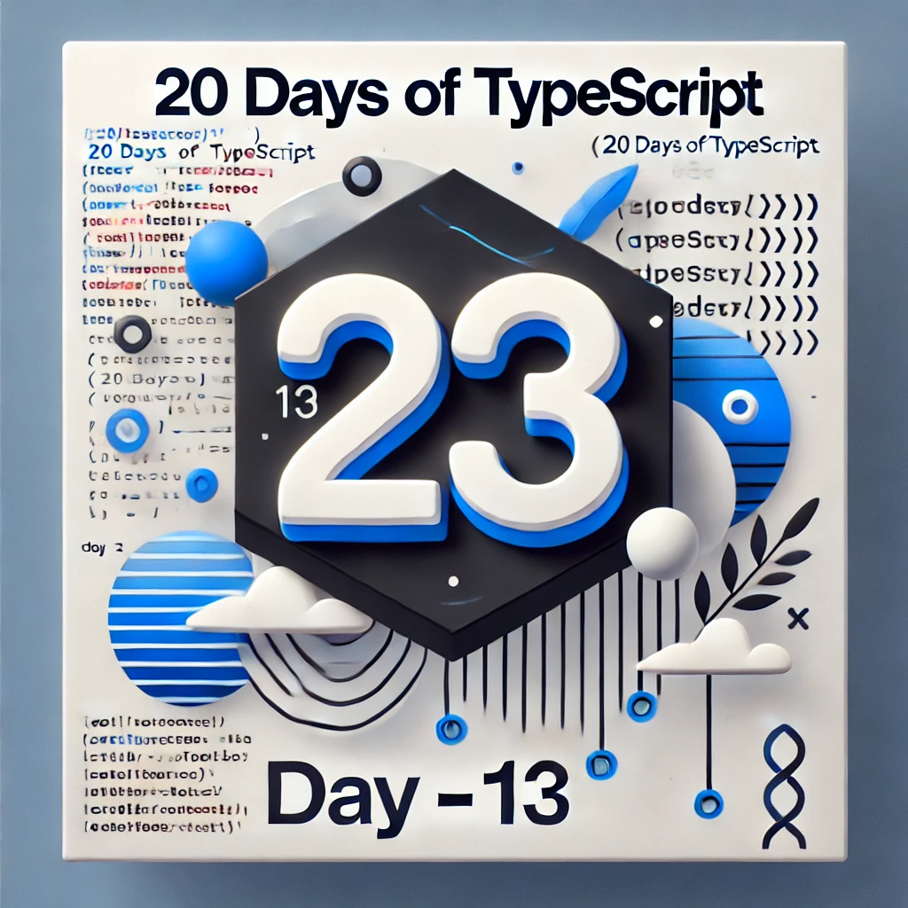

<div align="center"> 
  <h1>20 Days of Basics TypeScript: Classes 1</h1>
</div>

<div align="center"> 

<!-- Social links -->
[](htttps://discord.gg/Samson#0273) [](https://www.facebook.com/chiemezie.nebeolisa/) [](https://www.instagram.com/samson_nebeolisa/) [](https://www.linkedin.com/in/chiemezie-samson-nebeolisa-32897310b/) [](https://stackoverflow.com/users/20653301/nebeolisa-chiemezie-samson) [](https://twitter.com/SamsonChiemezie) [](https://myaccount.google.com/u/0/?utm_source=YouTubeWeb&tab=rk&utm_medium=act&tab=rk&hl=en) 

<!-- Portfolio -->
 📰 About Me [Portfolio](https://www.nebe-samson.com/)
 <br/>
  <small>Sep, 2024</small>
</div>

[<< Day 12](../Day12_Template_Literal_Types/Day12.md) | [Day 14 >>](../Day14_Classes_2/Day14.md)

<div align="center"> 
  <a class="header-image" target="_blank" href="../Asset/images/Days/Day_13.webp">
    
  </a>
</div>

## Table of Contents

- [📔 Day 13](#-day-13)
- [Classes in TypeScript](#classes-in-typeScript)
  - [Basic Class Structure](#basic-class-structure)
- [Adding Properties (Fields)](#adding-properties-fields)
  - [Fields with Initial Values](#fields-with-initial-values)
  - [Readonly Fields](#readonly-fields)
- [Class Constructors](#class-constructors)
- [Methods in Classes](#methods-in-classes)
  - [Getters and Setters](#getters-and-setters)
- [Index Signatures in Classes](#index-signatures-in-classes)
- [Class Inheritance](#class-inheritance)
  - [The `extends` Clause](#the-extends-clause)
  - [The `implements` Clause](#the-implements-clause)
  - [Key Differences Between `extends` and `implements`](#key-differences-between-extends-and-implements)
- [Overriding Methods](#overriding-methods)
  - [Example of Overriding](#example-of-overriding)
- [Calling `super()` in Inheritance](#calling-super-in-inheritance)
  - [Calling `super` in the Constructor](#calling-super-in-the-constructor)
  - [Calling `super` in Methods](#calling-super-in-methods)
- [💻 Day 13: Exercises](#-day-13-exercises)
  - [Exercise: Level 1](#exercise-level-1)
  - [Exercise: Level 2](#exercise-level-2)
  - [Exercise: Level 3](#exercise-level-3)


# 📔 Day 13

##  Classes in TypeScript

In TypeScript, __classes__ act as blueprints for creating objects, similar to how they work in other object-oriented programming languages. A class defines properties (the data the object holds) and methods (functions that operate on that data). The big advantage in TypeScript is that classes are __typed__, meaning that TypeScript ensures that you use properties and methods correctly, catching errors before they happen.

### Basic Class Structure

Let's start with the most basic class:

```ts
  class MyClass {}  // This is a class declaration
  const AnotherClass = class {};  // This is a class expression
```

Both of these create a class, but the key difference is:

- __Class Expression__ (`const AnotherClass = class {}`) gives the class a name that you can reference.
- Class Declaration (`class MyClass {}`) doesn't need a name.

Right now, these classes don’t do anything. So, let's add some properties and methods to make them useful.

## Adding Properties (Fields)

A field in a class is like a property that holds data. For example, let’s define a class `Point` that holds two properties: `x` and `y`, which represent coordinates:

```ts
  class Point {
    x: number;  // Declaring a field named 'x' that must be a number
    y: number;  // Declaring a field named 'y' that must be a number
  }

  // We can now instantiate (create an instance of) the class and set the values of x and y:
  const pt = new Point();
  pt.x = 0;
  pt.y = 0;

  // Same action can also be achieved using class expressions, like so:
  const Point = class {
    x: number;
    y: number;
  };

  const pm = new Point();
  pm.x = 10;
  pm.y = 20;
```

When you don’t explicitly declare a type for class properties, TypeScript assumes the type is `any` by default. This means the properties can hold any kind of value, which reduces the benefits of TypeScript's type safety. For example:

```ts
  class Point {
    x;  // No type is specified, so TypeScript defaults to 'any'
    y;  // 'any' type allows x and y to hold any value
  }
```

Here, both `x` and `y` implicitly get the any type, which allows them to store any kind of data, whether it's a number, string, or something else. This can lead to potential bugs because TypeScript can't warn you if you assign an unexpected type. It's always better to explicitly annotate these properties with specific types to make your code more predictable and secure.

### Fields with Initial Values

You can give your fields initial values when you declare them in the class. These initial values are automatically assigned when you create a new object from the class.

```ts
  class Point {
    x = 0;  // Default value for x
    y = 0;  // Default value for y
  }

  const pt = new Point();
  console.log(`${pt.x}, ${pt.y}`);  // Output: 0, 0
```

The `strictPropertyInitialization` setting in TypeScript ensures that all class fields are properly initialized before they are accessed. This setting is part of TypeScript’s `strict` mode, which aims to catch potential errors at compile time. When `strictPropertyInitialization` is enabled, TypeScript checks that each class property is either:

1. Initialized directly when declared in the class body, or
2. Assigned a value in the constructor, ensuring no property is left uninitialized.

If you forget to initialize a field and try to use it, TypeScript will raise an error, preventing potential runtime issues caused by uninitialized properties.

To enable the `strictPropertyInitialization` setting in TypeScript, Open your `tsconfig.json` file,
look for the `"compilerOptions"` section. If it doesn't exist, you can add it. Under `"compilerOptions"`, set `"strictPropertyInitialization"` to `true`:

```ts
  {
    "compilerOptions": {
      "strictPropertyInitialization": true
    }
  }
```

### Readonly Fields

Fields can also be marked as readonly, which ensures that they can only be assigned a value once, typically within the constructor. 

```ts
  class Greeter {
    readonly name: string = "world";  // 'name' is initialized to "world" and can't be changed outside the constructor
  }

  const greeter = new Greeter();
  console.log(greeter.name);  // Output: "world"

  greeter.name = "JavaScript";  // ❌ Error: 'Cannot assign to 'name' because it is a read-only property.
```

## Class Constructors

A constructor is a special function in a class that gets called when you create a new instance of the class. It’s used to initialize properties of the object. In TypeScript, constructors can have parameters, default values, and type annotations to ensure correct usage.

Here’s a basic example of a constructor in a `Point` class:

```ts
  class Point {
    x: number;
    y: number;

    constructor(x = 0, y = 0) {  // Constructor with default values
      this.x = x;
      this.y = y;
    }
  }
```

When you create a new `Point`, the constructor initializes the values for `x` and `y`. If you don’t provide any values, it defaults to `0`:

```ts
  const point = new Point();  // x = 0, y = 0
  const point2 = new Point(5, 10);  // x = 5, y = 10
```

Key Differences Between Constructors and Functions:

- Constructors can’t have their own type parameters. These should be defined on the class level, not in the constructor.
- Constructors don’t have a return type annotation. The class instance is always the implicit return.

## Methods in Classes

A method is a function defined within a class that operates on the class’s properties. Methods use the same type annotations as regular functions and can modify the class’s properties.

```ts
  class Point {
    x = 10;
    y = 10;

    scale(n: number): void {  // A method that scales x and y
      this.x *= n;
      this.y *= n;
    }
  }

  // You can call methods on an object after creating it:
  const pt = new Point();
  pt.scale(2);  // x = 20, y = 20
```

Here's another example with a `Person` class that includes a `greet` method:

```ts
  class Person {
    name: string;
    age: number;

    constructor(name: string, age: number) {
      this.name = name;
      this.age = age;
    }

    greet(): void { // method
      console.log(`Hello, my name is ${this.name} and I'm ${this.age} years old.`);
    }
  }

  const person = new Person("Samson", 30);
  person.greet();  // Outputs: Hello, my name is Samson and I'm 30 years old.
```

### Getters and Setters

Getters and setters allow you to control access to a class’s properties in a controlled way. A getter retrieves a property’s value, and a setter lets you modify it, while applying any logic you need, such as validation.

Here’s an example of a `BankAccount` class with a private balance that can only be accessed and modified via getters and setters:

```ts
  class BankAccount {
    private _balance: number = 0;

    get balance(): number {
      return this._balance;  // Getter to access balance
    }

    set balance(newBalance: number) {
      if (newBalance < 0) {
        throw new Error("Balance cannot be negative");
      }
      this._balance = newBalance;  // Setter to update balance with validation
    }
  }

  const account = new BankAccount();
  account.balance = 1000;  // Sets balance to 1000 using the setter
  console.log(account.balance);  // Outputs: 1000
  account.balance = -500;  // ❌ Throws an error: Balance cannot be negative
```

>[!NOTE]
> If a getter exists but there’s no setter, the property is automatically considered readonly. The type of the setter parameter is inferred from the return type of the getter if not explicitly defined.

## Index Signatures in Classes

In TypeScript, index signatures allow you to define the shape of dynamic properties in an object or class. This is useful when you don’t know the exact names of all properties, but you do know the type they will hold.

Here’s how index signatures work in a class:

```ts
  class MyClass {
    [key: string]: boolean | ((key: string) => boolean);  // Index signature

    check(key: string): boolean {
      return this[key] as boolean;  // Retrieves the property based on the key and treats it as a boolean
    }
  }
```

## Class Inheritance

Inheritance lets you create a new class (child class) that inherits properties and methods from an existing class (parent class). This is great for reusing code and adding extra functionality without repeating yourself. In TypeScript class inheritance, two key concepts often come up when working with classes: the `extends clause` and the `implements clause`.

### The `extends` Clause

When you see the word `extends`, think about inheritance. It allows one class (the child class) to inherit all the properties and methods from another class (the parent class).

Here’s a simple example where a `Vehicle` class is the parent class, and `Car` is a child class that extends it:

```ts
  class Vehicle {
    model: string;

    constructor(model: string) {
      this.model = model;
    }

    start() {
      console.log(`${this.model} is starting.`);
    }
  }

  // Car extends (inherits from) Vehicle
  class Car extends Vehicle {
    year: number;

    constructor(model: string, year: number) {
      super(model); // Calls the parent class constructor
      this.year = year;
    }

    drive() {
      console.log(`${this.model} from ${this.year} is driving.`);
    }
  }

  const myCar = new Car("Toyota", 2022);
  myCar.start();  // Output: Toyota is starting.
  myCar.drive();  // Output: Toyota from 2022 is driving.
```

### The `implements` Clause

While `extends` is about inheritance (getting functionality from a parent class), `implements` is about ensuring that a class follows a contract.

When a class implements an interface, it must define all the methods and properties described by the interface. An interface doesn’t provide any actual functionality — it just defines the structure that a class must have.

Here’s an example with a `Printable` interface and two classes (`Book` and `Magazine`) that implement it:

```ts
  // Define the interface
  interface Printable {
    print(): void;  // Any class that implements Printable must have this method
  }

  // The Book class implements the Printable interface
  class Book implements Printable {
    constructor(private title: string, private author: string) {}

    // Book must include the print() method to satisfy the interface
    print() {
      console.log(`${this.title} by ${this.author}`);
    }
  }

  // The Magazine class also implements the Printable interface
  class Magazine implements Printable {
    constructor(private name: string, private issueNumber: number) {}

    // Magazine must include the print() method to satisfy the interface
    print() {
      console.log(`${this.name} - Issue ${this.issueNumber}`);
    }
  }

  const myBook = new Book("TypeScript Guide", "Samson");
  myBook.print();  // Output: TypeScript Guide by Samson

  const myMagazine = new Magazine("Tech Weekly", 34);
  myMagazine.print();  // Output: Tech Weekly - Issue 34
```

Let’s say we have a class called Ball that is supposed to implement the Printable interface, but we forget to include the print() method:

```ts
  class Ball implements Printable {
    // Missing the required print method!
    pong() {
      console.log("pong!");
    }
  }

  // In this case, TypeScript will give us an error like this:
  // ❌ Error: Class 'Ball' incorrectly implements interface 'Printable'.
  // Property 'print' is missing in type 'Ball' but required in type 'Printable'.
```

This error happens because `Ball` promised to follow the `Printable` interface but didn't implement the required `print()` method. This is TypeScript’s way of helping us catch mistakes early.

### Key Differences Between `extends` and `implements`

|           Feature             |                                 `extends`                                     |                                                 `implements`                                              |
|:-----------------------------:|:-----------------------------------------------------------------------------:|:---------------------------------------------------------------------------------------------------------:|
| Purpose                       | Inherits properties and methods from a parent class.                          | Ensures a class follows a specific structure (defined by an interface).                                   |
| Reuse Code                    | Yes, the child class can reuse the logic from the parent class.               | No, the class must provide its own implementation of the methods in the interface.                        |
| Parent-Child Relationship     | Yes, creates a parent-child relationship between classes.                     | No, interfaces don’t provide actual functionality, just a contract to follow.                             |
| Number of Classes/Interfaces  | Can only extend one class (single inheritance).                               | Can implement multiple interfaces (multiple contracts).                                                   |
| Example Usage                 | Creating specialized versions of general objects (e.g., Car extends Vehicle). | Enforcing consistency across different types of objects (e.g., Book and Magazine must both be Printable). |

## Overriding Methods 

Understanding method overriding is key when you're working with object-oriented programming (OOP) concepts in TypeScript. Method overriding occurs when a child class provides a specific implementation of a method that is already defined in its parent class. In other words, the child class replaces the functionality of the parent class method with its own version.

Method overriding occurs when a child class provides a specific implementation of a method that is already defined in its parent class. In other words, the child class replaces the functionality of the parent class method with its own version.

### Example of Overriding

Imagine you have a parent class `Animal` that has a method `makeSound()`. This method defines a generic sound for any animal. However, specific animals like `Dog` and `Cat` make different sounds. By overriding the `makeSound()` method in the child classes, we can customize their behavior.

```ts
  // Parent class: Animal
  class Animal {
    name: string;

    constructor(name: string) {
      this.name = name;
    }

    // A generic sound method (to be overridden)
    makeSound(): void {
      console.log("The animal makes a sound");
    }
  }

  // Child class: Dog that overrides the makeSound method
  class Dog extends Animal {
    constructor(name: string) {
      super(name); // Calls the parent constructor
    }

    // Overriding the makeSound method with a custom implementation
    makeSound(): void {
      console.log("The dog barks");
    }
  }

  // Create instances and see how the overridden methods work
  const animal = new Animal("Fluffy");
  animal.makeSound(); // Output: The animal makes a sound

  const dog = new Dog("Buddy");
  dog.makeSound(); // Output: The dog barks
```

## Calling `super()` in Inheritance

When working with inheritance in TypeScript, just like in JavaScript, if a class extends a base class (parent class), you must call `super()` within the constructor of the derived class (child class). This ensures the parent class is properly initialized before you try to access any `this` members in the child class.

### Calling `super` in the Constructor

When a class extends another class, the child class needs to initialize the parent class's constructor before it can access `this` or add its own properties. This is done by calling `super()` in the constructor of the child class.

The `super()` call invokes the constructor of the parent class, ensuring that all the properties and initial setup from the parent class are properly inherited by the child class.

```ts
  class Shape {
    constructor(public color: string) {}
  }

  class Circle extends Shape {
    radius: number;

    constructor(color: string, radius: number) {
      super(color);  // Must call super to initialize the base class
      this.radius = radius;
    }
  }
```

TypeScript will warn you if you forget to call `super()` when required, making sure you handle inheritance correctly.

### Calling `super` in Methods

In addition to calling `super()` in the constructor, sometimes you may want to override a method in the child class but still leverage some of the functionality from the parent class. You can do this by explicitly calling `super.methodName()` from the overridden method in the child class. This allows the child class to build upon the behavior defined in the parent class rather than completely replacing it.

Using `super` in a method lets you reuse the parent’s logic while adding or modifying functionality in the child class.

```ts
  class Animal {
    constructor(public name: string) {}

    makeSound() {
      console.log(`${this.name} is making a sound.`);
    }
  }

  class Cat extends Animal {
    constructor(name: string, public breed: string) {
      super(name);  // Calls the parent class constructor
    }

    // Overriding the makeSound method but keeping the parent behavior
    makeSound() {
      super.makeSound();  // Calls the parent class method
      console.log(`${this.name}, the ${this.breed}, is meowing!`); // Adds custom behavior
    }
  }

  // Create an instance of Cat32 and see the output
  const cat = new Cat("Buddy", "Golden Retriever");
  cat.makeSound();
  // Output:
  // Buddy is making a sound.
  // Buddy, the Golden Retriever, is meowing!
```

🌟 Awesome job! You’ve successfully completed your Day 13, and you're well on your way to becoming a great developer. Keep up the momentum! Now, let's keep your mind sharp and your body active with some quick exercises.

## 💻 Day 13: Exercises

### Exercise: Level 1

1. Create a `Product` class with a property `price`. Write a method `applyDiscount(discount: number)` that reduces the `price` by a given discount percentage. Create an instance of `Product` with a price of 100 and apply a 10% discount.

2. Create a `BankAccount` class that has a private property `balance` and a method `deposit(amount: number)` that increases the balance. Add a method `getBalance()` that returns the current balance. Ensure that the `balance` can't be accessed directly from outside the class. Create an instance of `BankAccount` with an initial balance of 0, deposit 500, and then check the balance.

3. Create a class `Car` with a `model` property and a `year` property that defaults to 2023. Write a constructor to initialize model and optionally `year`. If the `year` is not provided, it should use the default value. Create an instance of `Car` without passing the year. What is the value of year?

4. Create a parent class `Employee` with a property `name` and a method `work()`. Then, create a child class `Manager` that extends `Employee` and overrides the `work()` method to add an extra behavior: calling a new method `attendMeeting()`. Create an instance of `Manager` and call the `work()` method.

### Exercise: Level 2

5. Define a parent class `Bird` with a method `fly()` that logs `"The bird flies"`. Then, create a child class `Penguin` that overrides the `fly()` method to log `"Penguins cannot fly"`. Create instances of both classes and call `fly()` on each.

6. Create a class `User` with a method `login()` that logs `"User logged in"`. Create a child class `Admin` that overrides the `login()` method to also log `"Admin has special privileges"` but still calls the `login()` method from the User class. 

7. Create two interfaces: `Eater` with a method `eat()`, and `Sleeper` with a method `sleep()`. Then create a class `Person` that implements both `Eater` and `Sleeper`, defining both methods. Instantiate the class and call both methods.

8. Create an interface `Playable` with a method `start()`. Then create a class `VideoGame` that implements `Playable` and adds another method `pause()`. Ensure the class works with both start() and `pause()`. How would you instantiate `VideoGame` and call both methods?

### Exercise: Level 3

9. Write a class `Book` with two constructors: one that takes both `title` and `author`, and another that only takes `title` and defaults `author` to `"Unknown"`. Create two instances, one with both properties and one with only the `title`. How does TypeScript handle constructor overloading?

10. Write a class `Logger` with a method `log(message: string, level?: string)`. The `level` parameter should be optional and default to `"INFO"`. If the level is `"ERROR"`, it should prepend `"ERROR: "` to the message. Test the method by logging a normal message and an error message. 

11. Create a generic class `Box<T>` that can store an item of any type (`T`). Add methods `store(item: T)` and `retrieve()` to store and retrieve the item. Test the class with both `number` and `string` types. How does TypeScript ensure type safety in this scenario?

🎉 CONGRATULATIONS ! 🎉

[<< Day 12](../Day12_Template_Literal_Types/Day12.md) | [Day 14 >>](../Day14_Classes_2/Day14.md)