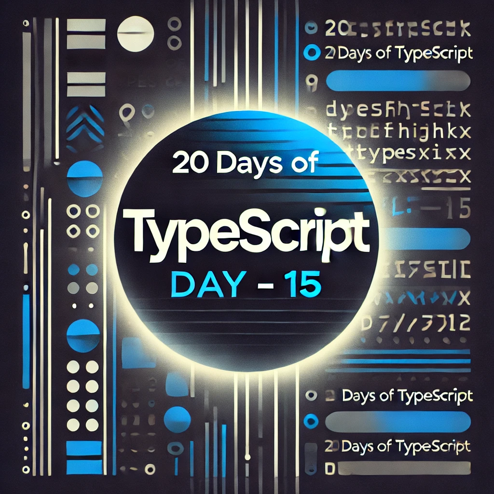

<div align="center"> 
  <h1>20 Days of Basics TypeScript: Modules</h1>
</div>

<div align="center"> 

<!-- Social links -->
[](htttps://discord.gg/Samson#0273) [](https://www.facebook.com/chiemezie.nebeolisa/) [](https://www.instagram.com/samson_nebeolisa/) [](https://www.linkedin.com/in/chiemezie-samson-nebeolisa-32897310b/) [](https://stackoverflow.com/users/20653301/nebeolisa-chiemezie-samson) [](https://twitter.com/SamsonChiemezie) [](https://myaccount.google.com/u/0/?utm_source=YouTubeWeb&tab=rk&utm_medium=act&tab=rk&hl=en) 

<!-- Portfolio -->
 📰 About Me [Portfolio](https://www.nebe-samson.com/)
 <br/>
  <small>Sep, 2024</small>
</div>

[<< Day 14](../Day14_Classes_2/Day14.md) | [Day 16 >>](../Day16_Utility_Types/Day16.md)

<div align="center"> 
  <a class="header-image" target="_blank" href="../Asset/images/Days/Day_15.webp">
    
  </a>
</div>

## Table of Contents

- [📔 Day 15](#-day-15)
- [Modules in TypeScript](#modules-in-typescript)
  - [Why Use Modules?](#why-use-modules)
- [Working with Modules](#working-with-modules)
- [Exporting from a Modules](#exporting-from-a-modules)
  - [Named Exports](#named-exports)
  - [Default Exports](#default-exports)
- [Importing from a Modules](#importing-from-a-modules)
  - [Named Imports vs. Default Imports](#named-imports-vs-default-imports)
  - [Named Imports](#named-imports)
  - [Default Imports](#default-imports)
- [Renaming Imports](#renaming-imports)
- [Mixing Named and Default Imports](#mixing-named-and-default-imports)
- [Re-exporting Modules](#re-exporting-modules)
- [Best Practices for Using Modules](#best-practices-for-using-modules)
- [Important Notes About Modules](#important-notes-about-modules)
- [💻 Day 15: Exercises](#-day-15-exercises)
  - [Exercise: Level 1](#exercise-level-1)
  - [Exercise: Level 2](#exercise-level-2)
  - [Exercise: Level 3](#exercise-level-3)


# 📔 Day 15

##  Modules in TypeScript 

Modules are an essential part of TypeScript (and modern JavaScript), allowing you to break your code into smaller, more manageable pieces. Think of modules as a way to split your project into different files, where each file can contain its own variables, functions, classes, or interfaces. You can then export functionality from one module and import it into another. This keeps your code organized and easy to maintain.

TypeScript follows the ES6 module system, which is now widely used across modern web development.

### Why Use Modules?

Modules come with many benefits:

1. __Code Organization__: Modules help you logically structure your code by splitting it into different files.

2. __Encapsulation__: They let you hide implementation details, only exposing what other parts of your project need.

3. __Reusability__: Once you create a module, you can easily reuse it across your project, or even in other projects.

4. __Maintainability__: Well-structured, focused modules are easier to update and maintain.

5. __Dependency Management__: Modules make it clear what each file depends on, making your project more predictable.

6. __Namespace Collision Prevention__: Only what you explicitly export from a module is available elsewhere, reducing the chance of conflicts.

## Working with Modules

In TypeScript, we use two main keywords for modules:

- `export`: To make a function, class, or variable available for use in other modules.
- `import`: To bring in functionality from other modules.

## Exporting from a Modules

Just like in JavaScript, there are two main ways to export in TypeScript: __Named Exports__ and __Default Exports__.

### Named Exports

You can have multiple named exports in a single file. This allows you to export several variables, functions, or classes from the same module.

Let's look at how to achieve both named and default exports.

```ts
  // Day11.ts file

  export function add(a: number, b: number): number {
    return a + b;
  }

  export function subtract(a: number, b: number): number {
    return a - b;
  }

  export const PI = 3.14159;

  export class myNamedExport {
    constructor(public radius: number) {}

    area(): number {
      return PI * this.radius ** 2;
    }
  }
```

Here, We export two functions (`add` and `subtract`), a constant (`PI`), and a class (`myNamedExport`).

### Default Exports

A file can have only one default export. This is useful when you want to export a single primary function or class from a module.

```ts
  // Day12.ts file

  export default function formatToCurrency(value: number): string {
    return `$${value.toFixed(2)}`;
  }
```

Here, the formatToCurrency function is the default export, meaning it’s the main thing this file is exporting.

## Importing from a Modules

Once you've exported something from a module, the next step is to import it into another file. This allows you to share functionality across different parts of your application. In TypeScript, imports can be handled in two main ways: __Named Imports__ and __Default Imports__. You can use both types of imports in a single file, and there are some simple rules to follow when doing so.

### Named Imports vs. Default Imports

- __Named Imports__: These are used to import specific exports from a module. You need to use curly braces {} to wrap the names of the things you're importing.

- __Default Imports__: When a module has a default export, you can import it without curly braces. Each file can only have one default export, but it can have multiple named exports.

Let's look at how you can import both named and default exports.

### Named Imports

In this example, we're importing some of the exports from `Day11.ts` like `add`, `subtract`, and `PI`.

```ts
  // Day13.ts file

  import { add, subtract, PI, myNamedExport } from './Day11.ts'; // Import specific named exports

  console.log(add(5, 3));  // Outputs: 8
  console.log(subtract(5, 3));  // Outputs: 2
  console.log(PI);  // Outputs: 3.14159

  const circle = new myNamedExport(5);
  console.log(circle.area());  // Outputs: 78.53975
```

### Default Imports

Here, we're importing the default export from Day12.ts, which is a function that formats a number as currency.

```ts
  // Day14.ts file

  import formatToCurrency from './Day12.ts'; // Import default export

  console.log(formatToCurrency(5000)); // Outputs: $5000.00
```

## Renaming Imports

Sometimes you might want to rename an imported function or class for clarity or to avoid conflicts. You can rename both named and default imports using the `as` keyword.

```ts
  // Renaming default import
  import formatToCurrency as format from './Day12.ts';

  console.log(format(5000)); // Outputs: $5000.00
```

## Mixing Named and Default Imports

If a module exports both named and default exports, you can combine them in a single import statement.

Imagine that `Day11.ts` now has both named and default exports.

```ts
  // Day11.ts

  export default const multiply = (a: number, b: number): number => {
    return a * b;
  };

  export function add(a: number, b: number): number {
    return a + b;
  }

  export function subtract(a: number, b: number): number {
    return a - b;
  }

  export const PI = 3.14159;

  export class myNamedExport {
    constructor(public radius: number) {}
    area(): number {
      return PI * this.radius ** 2;
    }
  }
```

Now you can import both the default export (multiply) and the named exports from the same file in one line.

```ts
  // myFile.ts

  import multiply, { add, subtract, PI, myNamedExport } from './Day11.ts';

  console.log(multiply(4, 5));    // Outputs: 20
  console.log(add(10, 5));        // Outputs: 15
  console.log(subtract(10, 5));   // Outputs: 5
  console.log(PI);                // Outputs: 3.14159
```

## Re-exporting Modules

Sometimes you may want to re-export everything from one module inside another module. This is useful if you want to group all your utility functions or shared components into a single module. You can do this using the `export *` syntax.

```ts
  // Day15.ts

  export * from './Day11.ts';  // Re-export everything from Day11.ts
  export { default as formatToCurrency } from './Day12.ts';  // Re-export Day12.ts default export
```

Now, instead of importing from `Day11.ts` and `Day12.ts` separately, you can import everything from `Day15.ts`.

```ts
  // Day16.ts

  import { add, subtract, PI, myNamedExport, formatToCurrency } from './Day15.ts';

  console.log(add(10, 2));             // Outputs: 12
  console.log(formatToCurrency(100));  // Outputs: $100.00
```

## Best Practices for Using Modules

To get the most out of TypeScript modules, here are a few tips:

1. It's a good practice to keep each module in its own file. This keeps your code clean and organized.

2. Use clear, descriptive names for your modules and exports. This makes your code easier to understand for others (and for your future self!).

3. Be careful not to create circular references between modules, as this can cause unexpected behavior or errors.

4. For large projects, consider using barrel files (like index.ts) to group and re-export multiple modules from a single file.

5. Named exports are often easier to refactor and manage because they are more explicit. Default exports can sometimes lead to confusion if not used carefully.

## Important Notes About Modules

- In TypeScript, every file that contains an import or export statement is treated as a module.

- Variables, functions, classes, and other members declared inside a module are not visible outside that module unless they are explicitly exported.

-  When you import a module using `import './module'`, TypeScript looks for files with `.ts`,`.tsx`, or `.d.ts` extensions by default.

By mastering how to import and export modules in TypeScript, you’ll have the tools to create well-structured, maintainable, and scalable code for any project!

🌟 Awesome job! You’ve successfully completed your Day 15, and you're well on your way to becoming a great developer. Keep up the momentum! Now, let's keep your mind sharp and your body active with some quick exercises.

## 💻 Day 15: Exercises

### Exercise: Level 1

1. Create a `mathOperations.ts` file that contains two named exports: a function `add(a: number, b: number): number` and a function `multiply(a: number, b: number): number`. Then, create another file called `main.ts` where you import and use both of these functions.

2. Create a `formatter.ts` file that has a default export function `formatDate(date: Date): string`, which returns the date formatted as `"MM/DD/YYYY"`. In another file, `app.ts`, import this function and test it by passing a new `Date()` object.

3. Create a module `stringUtils.ts` with named exports: a function `toUpperCase(str: string): string` and a function `toLowerCase(str: string): string`. In `app.ts`, import both functions but rename them to `uppercase` and `lowercase`, respectively. Then, use these renamed imports in `app.ts`.

### Exercise: Level 2

4. Create two modules: `mathHelpers.ts` with functions `square(num: number): number` and` cube(num: number): number`, and `stringHelpers.ts` with functions `capitalize(str: string): string` and `reverse(str: string): string`. Then, create a new file `utils.ts` that re-exports all the functions from both `mathHelpers.ts` and `stringHelpers.ts`. Finally, import all the functions in `main.ts` from `utils.ts` and use them.

5. Create an `interfaces.ts` file with an interface `Person` that contains the fields `name` and `age`. In another file `data.ts`, create a variable `personData` that implements the `Person` interface and export it. Import this variable in a new file `app.ts` and log the `name` and `age` properties.

6. Create a file `user.ts` with a default export `class User` that has a constructor with `username: string` and a method `getUsername(): string`. Also, add a named export `function validateUsername(username: string): boolean`, which checks if the username is at least 6 characters long. In `app.ts`, import both the default and named exports and:

- Create a new `User` instance.
- Use the `validateUsername` function to validate the username before creating the instance.

### Exercise: Level 3

7. Create a folder `shapes/` with three files:

- `circle.ts`: Exports a `class Circle` with a method `getArea(radius: number): number`.
- `rectangle.ts`: Exports a `class Rectangle` with a method `getArea(width: number, height: number): number`.
- `triangle.ts`: Exports a `class Triangle` with a method `getArea(base: number, height: number): number`.
Now, create an `index.ts` file inside the `shapes/` folder that re-exports all the classes from the three files. Finally, in `app.ts`, import all these classes from `shapes/index.ts` and use them to calculate the area of different shapes.

8. Create a file `dataUtils.ts` that exports a generic function `filterItems<T>(items: T[], callback: (item: T) => boolean): T[]`, which filters an array based on a condition passed in the callback function. Then, create another file `main.ts` where you:

- Create an array of objects `[{ name: 'Alice', age: 25 }, { name: 'Bob', age: 30 }]`.
- Use `filterItems` to filter out people who are older than 28.

9. Create a module `storage.ts` with a generic `class Storage<T>`. This class should have methods `addItem(item: T): void`, `getItem(index: number): T`, and `removeItem(index: number): void`.
Use constraints to ensure `T` can only be of type `string` or `number`. In `app.ts`, create two instances of `Storage`:

- One that stores numbers.
- One that stores strings.
Test each instance by adding, retrieving, and removing items.


🎉 CONGRATULATIONS ! 🎉

[<< Day 14](../Day14_Classes_2/Day14.md) | [Day 16 >>](../Day16_Utility_Types/Day16.md)