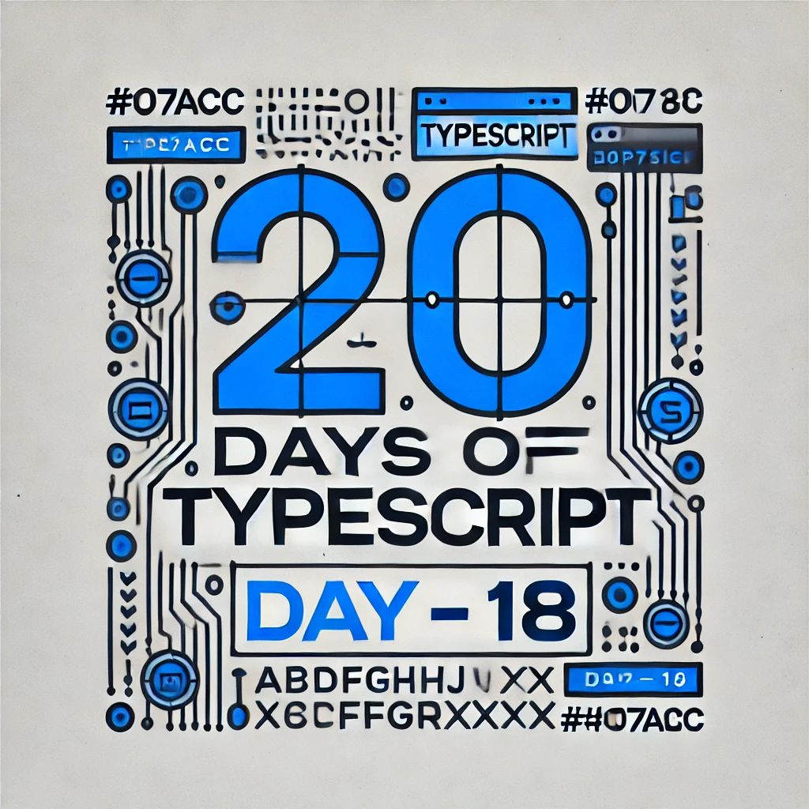

<div align="center"> 
  <h1>20 Days of Basics TypeScript: DOM Manipulation</h1>
</div>

<div align="center"> 

<!-- Social links -->
[](htttps://discord.gg/Samson#0273) [](https://www.facebook.com/chiemezie.nebeolisa/) [](https://www.instagram.com/samson_nebeolisa/) [](https://www.linkedin.com/in/chiemezie-samson-nebeolisa-32897310b/) [](https://stackoverflow.com/users/20653301/nebeolisa-chiemezie-samson) [](https://twitter.com/SamsonChiemezie) [](https://myaccount.google.com/u/0/?utm_source=YouTubeWeb&tab=rk&utm_medium=act&tab=rk&hl=en) 

<!-- Portfolio -->
 📰 About Me [Portfolio](https://www.nebe-samson.com/)
 <br/>
  <small>Sep, 2024</small>
</div>

[<< Day 17](../Day17_Enums/Day17.md) | [Day 19 >>](../Day19_Dom_Practice/Day19.md)

<div align="center"> 
  <a class="header-image" target="_blank" href="../Asset/images/Days/Day_18.webp">
    
  </a>
</div>

## Table of Contents

- [📔 Day 18](#-day-18)
- [DOM Manipulation with TypeScript](#dom-manipulation-with-typescript)
  - [Setting Up TypeScript for DOM Manipulation](#setting-up-typeScript-for-dom-manipulation)
  - [Selecting and Modifying Elements](#selecting-and-modifying-elements)
  - [Type Assertions with DOM Elements](#type-assertions-with-dom-elements)
  - [Creating and Appending Elements](#creating-and-appending-elements)
  - [Handling Events with TypeScript](#handling-events-with-typescript)
  - [Modifying Element Styles](#modifying-element-styles)
  - [Working with Forms and Input Elements](#working-with-forms-and-input-elements)
- [💻 Day 18: Exercises](#-day-18-exercises)
  - [Exercise: Level 1](#exercise-level-1)
  - [Exercise: Level 2](#exercise-level-2)
  - [Exercise: Level 3](#exercise-level-3)


# 📔 Day 18

##  DOM Manipulation with TypeScript 

If you're familiar with JavaScript, you already know how to manipulate the DOM (Document Object Model) to interact with and modify HTML elements. TypeScript allows you to do the same thing, but with the added benefits of type safety and better tooling support.

> As I mentioned at the beginning of this course, I won't be diving deeply into basic JavaScript concepts when discussing TypeScript. I’m assuming you already have a foundational understanding of JavaScript DOM Manipulation. This allows us to focus more on how TypeScript enhances these familiar structures with features like strong typing and better error handling

### Setting Up TypeScript for DOM Manipulation

To work with TypeScript and DOM manipulation, you need to make sure your TypeScript project is correctly set up. You typically have a `tsconfig.json` file, and your TypeScript code will be in `.ts` files.

In your `tsconfig.json`, ensure that TypeScript can work with DOM types by including the `"dom"` library:

```ts
  {
    "compilerOptions": {
      "target": "es6",
      "lib": ["dom", "es6"],
      "strict": true
    }
  }
```

This gives TypeScript access to DOM-related types, so it can help you write type-safe code when manipulating HTML elements.

### Selecting and Modifying Elements

Let’s start with a simple example. Assume we have this HTML structure:

```ts
  <div id="app">
    <h1>Hello World</h1>
    <button id="changeText">Change Text</button>
  </div>
```

In TypeScript, we can select and modify elements using getElementById and other DOM methods, similar to JavaScript.

```ts
  const appDiv = document.getElementById('app'); // TypeScript infers: HTMLElement | null
  const button = document.getElementById('changeText'); // HTMLElement | null

  if (appDiv && button) {

    button.addEventListener('click', () => {

      const heading = appDiv.querySelector('h1'); // Element | null

      if (heading) {

        heading.textContent = 'Text Changed!'; // Change the text of the heading
      }
    });
  }
```

### Type Assertions with DOM Elements

Occasionally, TypeScript requires more precise information about the type of an element, particularly when dealing with inputs or specialized HTML elements. If you recall from Day 2 of this course, we discussed type assertions, which allow you to explicitly tell TypeScript the specific type of an element. This ensures TypeScript knows exactly how to handle the element, giving you greater control and reducing potential errors.

```ts
  // Type assertion for Input Elements
  const inputElement = document.getElementById('username') as HTMLInputElement;

  if (inputElement) {
    inputElement.value = 'John Doe'; // Set the value of the input
  }
```

Here, we use `as HTMLInputElement` to tell TypeScript that `inputElement` is an input field. This ensures that TypeScript knows it can access properties like `.value`.

### Creating and Appending Elements

You can also create new elements and append them to the DOM using TypeScript.

```ts
  const newDiv = document.createElement('div');
  newDiv.textContent = 'This is a new div element';

  const container = document.getElementById('container');

  if (container) {
    container.appendChild(newDiv); // Add the new div to the container
  }
```

In this example, we create a new `<div>` element and add it to the `container` element in the DOM.

### Handling Events with TypeScript

TypeScript provides strong typing for DOM events, making it easier to work with event handlers like clicks, submits, and key presses.

```ts
  const button = document.querySelector('button');

  if (button) {
    button.addEventListener('click', (event: MouseEvent) => {
      console.log('Button clicked!', event);
    });
  }
```

In this example, the `MouseEvent` type is automatically inferred by TypeScript for the click event, providing better IntelliSense and type safety.

Here's a table of some common TypeScript event types and their uses, which can help you when handling various events in web development:

| **Event Type**          | **Description**                                                                                                | **Use Case**                                                                                                 |
|:-----------------------:|:--------------------------------------------------------------------------------------------------------------:|:------------------------------------------------------------------------------------------------------------:|
| `MouseEvent`            | Represents events related to the mouse, such as clicks, double clicks, and movements.                          | Used for detecting mouse actions like clicks on buttons, hovering over elements, or dragging.                |
| `KeyboardEvent`         | Represents events triggered by the keyboard, such as key presses and releases.                                 | Useful for handling keyboard shortcuts, form validation on key press, or capturing key input.                |
| `FocusEvent`            | Represents focus-related events such as when an element gains or loses focus.                                  | Commonly used for handling form input focus/blur events, like highlighting a text field when focused.        |
| `InputEvent`            | Represents events triggered by user input, typically from `<input>`, `<textarea>`, or `<select>` elements.     | Used for real-time form validation, capturing input data as the user types, or reacting to input changes.    |
| `SubmitEvent`           | Represents events triggered by form submission.                                                                | Typically used for handling form submissions, validating input data before sending it to a server.           |
| `ChangeEvent`           | Represents events triggered when the value of an input, select, or textarea element changes.                   | Used to track changes in form inputs (like dropdowns, checkboxes, or text inputs).                           |
| `DragEvent`             | Represents events triggered during drag-and-drop interactions.                                                 | Useful for handling file uploads, reordering items, or moving elements within the DOM via drag-and-drop.     |
| `WheelEvent`            | Represents events triggered by mouse wheel actions (scrolling).                                                | Used for capturing scroll events, zooming actions, or handling custom scrolling behavior.                    |
| `TouchEvent`            | Represents events triggered by touch interactions on touchscreen devices.                                      | Essential for handling touch gestures like swipe, pinch, or tap on mobile and touchscreen devices.           |
| `PointerEvent`          | Represents events triggered by pointer actions, supporting mouse, touch, and stylus interactions.              | A more generalized event for handling input from a variety of devices (mouse, touch, stylus, etc.).          |
| `ClipboardEvent`        | Represents events related to clipboard actions (cut, copy, paste).                                             | Used for handling text copying, cutting, and pasting within input fields or text areas.                      |
| `FocusEvent`            | Represents when an element gains or loses focus.                                                               | Used to trigger specific actions when a user focuses on or blurs a form field or another interactive element.|
| `AnimationEvent`        | Represents events triggered during CSS animations.                                                             | Used to track the start, iteration, or end of CSS animations in elements.                                    |
| `TransitionEvent`       | Represents events triggered during CSS transitions.                                                            | Useful for detecting when a CSS transition starts or ends.                                                   |
| `ResizeEvent`           | Represents events triggered when the document view (window) is resized.                                        | Commonly used for adjusting layouts, images, or elements based on window size changes (responsive design).   |
| `ScrollEvent`           | Represents events triggered when an element is scrolled.                                                       | Used to trigger actions when the user scrolls through a webpage or specific container.                       |
| `PopStateEvent`         | Represents events triggered when the active history entry changes (usually in the context of single-page apps).| Used in SPAs for handling browser navigation (back/forward) and updating the view accordingly.               |

Let’s expand on event handling by working with `keydown` events, which are commonly used for form validation or keyboard shortcuts.

```ts
  const inputField = document.getElementById('userInput') as HTMLInputElement;

  if (inputField) {

    inputField.addEventListener('keydown', (event: KeyboardEvent) => {

      if (event.key === 'Enter') {

        console.log('Enter key was pressed!');
      }
    });
  }
```

In this example, TypeScript automatically knows that the event is a `KeyboardEvent`, allowing us to safely access the `.key` property to detect if the `Enter` key was pressed.

### Modifying Element Styles

You can modify the style of elements directly using the `.style` property in TypeScript. Just like in JavaScript, TypeScript lets you change things like `backgroundColor`, `width`, and `height`.

```ts
  const box = document.getElementById('box') as HTMLDivElement;

  if (box) {
    box.style.backgroundColor = 'blue'; // Change background color
    box.style.width = '100px'; // Set width
    box.style.height = '100px'; // Set height
  }
```

In this case, we use type assertion (`as HTMLDivElement`) to ensure that `box` is treated as a `div` element with style properties.

### Working with Forms and Input Elements

Handling forms and input elements is another common task in DOM manipulation. TypeScript helps by ensuring that you access input values correctly and handle form submissions safely.

```ts
  const form = document.querySelector('form');
  const input = document.getElementById('userInput') as HTMLInputElement;

  if (form) {

    form.addEventListener('submit', (event: Event) => {

      event.preventDefault(); // Prevent the form from submitting

      alert(`Input value: ${input.value}`); // Show the input value
    });
  }
```

🌟 Awesome job! You’ve successfully completed your Day 18, and you're well on your way to becoming a great developer. Keep up the momentum! Now, let's keep your mind sharp and your body active with some quick exercises.

## 💻 Day 18: Exercises

### Exercise: Level 1

1. Write a TypeScript function called `changeTitle` that selects an HTML element with an ID of `"pageTitle"` and changes its text content to `"Welcome to TypeScript!"`. Make sure to check if the element exists before modifying it.

2. Create a TypeScript function `setupButtonClick` that selects a button with the ID `"myButton"` and listens for the `"click"` event. When clicked, it should log the message `"Button clicked!"` to the console. Ensure the button exists before adding the event listener.

3. Write a TypeScript function `handleFormSubmit` that listens to the `"submit"` event on a form with the ID `"userForm"`. When the form is submitted, it should prevent the default action and log the value of an input field with the ID `"username"`.

### Exercise: Level 2

4. Write a function `createList` that accepts an array of strings and creates an unordered list (`<ul>`) with list items (`<li>`) for each string in the array. The list should be appended to a `div` with the ID `"listContainer"`.

5. Create a TypeScript function `toggleBoxColor` that selects a `div` with the ID `"colorBox"`. The function should change its background color to `"blue"` if the current color is `"red"`, and to `"red"` if the current color is "blue"`.

6. Write a function `handleKeyPress` that listens for the `"keydown"` event on an input field with the ID `"userInput"`. If the user presses the `"Enter"` key, the function should log the message `"Enter pressed!"` to the console. 

7. Create a function `appendMultipleDivs` that takes a number `n` and appends `n` number of `div` elements to a container with the ID `"container"`. Each `div` should have the text content `"Div #n"` where `n` is its number (e.g., `"Div #1"`, `"Div #2"`, etc.).

### Exercise: Level 3

8. Write a function `setupDynamicContent` that listens for a change event on a `select` element with the ID `"colorSelect"`. When the user selects a color, the function should dynamically create and append a `div` with the selected color as its background to a container with the ID `"dynamicContainer"`. The background color of the `div` should match the selected color.

9. Write a TypeScript function `updateElementContent` that overloads based on the type of the input. If the input is a string, it sets the text content of an element with a given ID to that string. If the input is a number, it sets the text content to `"Value: n"` where n is the number.

10. Create a function `loadDataAndDisplay` that fetches JSON data from an API (use `fetch`), then creates and appends a paragraph (`<p>`) with the data inside a `div` with the ID `"dataContainer"`. Use TypeScript's `async/await` for handling the asynchronous fetch.


🎉 CONGRATULATIONS ! 🎉

[<< Day 17](../Day17_Enums/Day17.md) | [Day 19 >>](../Day19_Dom_Practice/Day19.md)