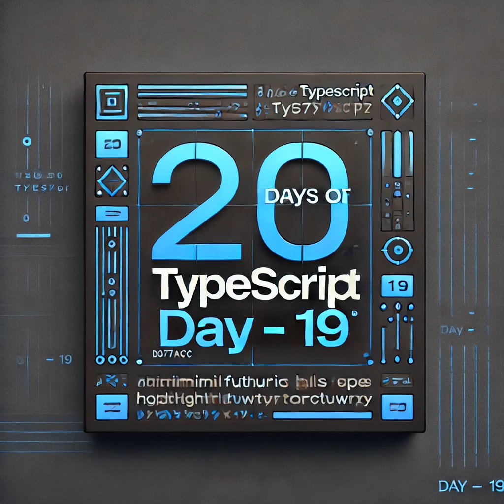
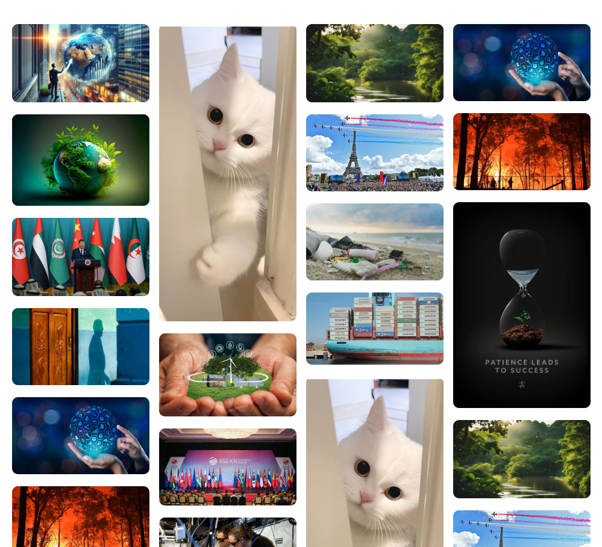
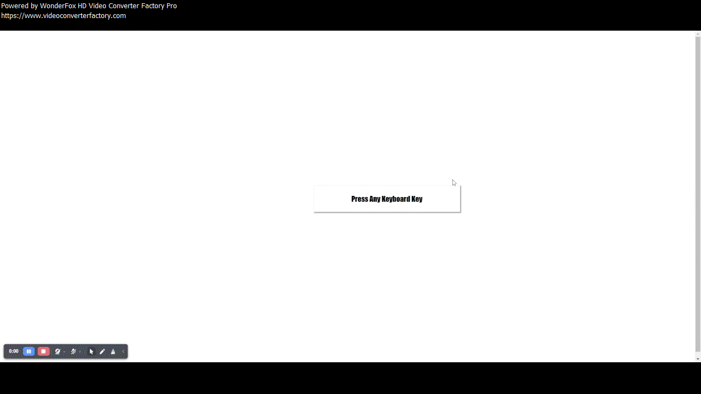
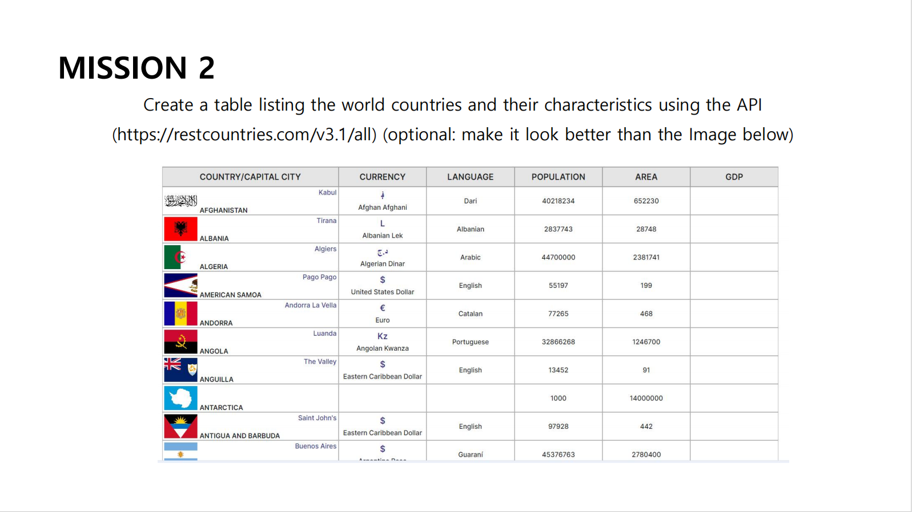
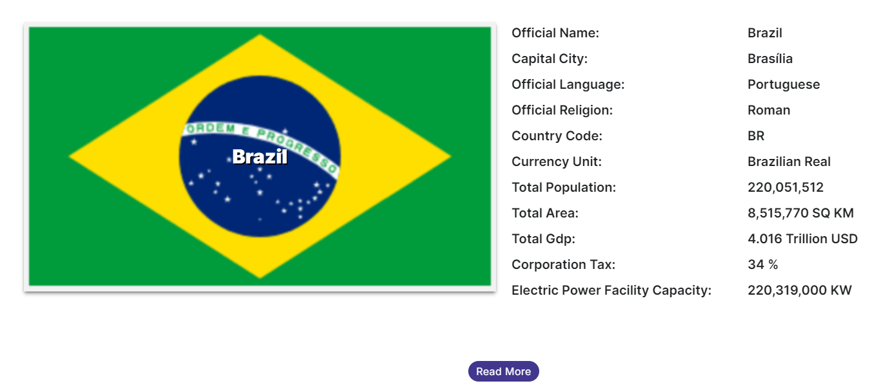

<div align="center"> 
  <h1>20 Days of Basics TypeScript: DOM Practice</h1>
</div>

<div align="center"> 

<!-- Social links -->
[](htttps://discord.gg/Samson#0273) [](https://www.facebook.com/chiemezie.nebeolisa/) [](https://www.instagram.com/samson_nebeolisa/) [](https://www.linkedin.com/in/chiemezie-samson-nebeolisa-32897310b/) [](https://stackoverflow.com/users/20653301/nebeolisa-chiemezie-samson) [](https://twitter.com/SamsonChiemezie) [](https://myaccount.google.com/u/0/?utm_source=YouTubeWeb&tab=rk&utm_medium=act&tab=rk&hl=en) 

<!-- Portfolio -->
 📰 About Me [Portfolio](https://www.nebe-samson.com/)
 <br/>
  <small>Sep, 2024</small>

  <p>
    <small>Support the <strong>author</strong> to create more educational materials</small>
     <br/>
     
  [](https://paypal.me/ChiemezieSamson?country.x=KR&locale.x=en_US)
  </p>
</div>

[<< Day 18](../Day18_DOM_Manipulation/Day18.md) | [Day 20 >>](../Day20_Final_Project/Day20.md)

<div align="center"> 
  <a class="header-image" target="_blank" href="../Asset/images/Days/Day_19.webp">
    
  </a>
</div>

## Table of Contents

- [📔 Day 19](#-day-19)
- [𝐌𝐚𝐬𝐨𝐧𝐫𝐲 𝐋𝐚𝐲𝐨𝐮𝐭𝐬](#m𝐚𝐬𝐨𝐧𝐫𝐲-l𝐚𝐲𝐨𝐮𝐭𝐬)
  - [𝐔𝐬𝐞 𝐂𝐚𝐬𝐞𝐬](#u𝐬𝐞-c𝐚𝐬𝐞𝐬)
  - [Project Image](#project-image𝐬)
  - [Project CSS ](#project-css)
  - [TypeScript Code](#typescript-code)
- [Interactive Keyboard Key Press Display](#interactive-keyboard-key-press-display)
   - [Project Image](#project-image𝐬)
   - [TypeScript Code](#typescript-code)
- [💻 Day 19: Exercises](#-day-19-exercises)
  - [Exercise: Level 1](#exercise-level-1)
  - [Exercise: Level 2](#exercise-level-2)
  - [Exercise: Level 3](#exercise-level-3)


# 📔 Day 19

##  𝐌𝐚𝐬𝐨𝐧𝐫𝐲 𝐋𝐚𝐲𝐨𝐮𝐭𝐬

A masonry layout is a web design pattern that arranges elements in a grid-like structure, but unlike traditional grids, it does not strictly adhere to a uniform row and column structure. Instead, masonry layouts position items based on available vertical space, allowing them to stack vertically in a visually appealing way. This creates a more dynamic and organic look, similar to how bricks are arranged in a wall.

### 𝐔𝐬𝐞 𝐂𝐚𝐬𝐞𝐬

- 𝐈𝐦𝐚𝐠𝐞 𝐆𝐚𝐥𝐥𝐞𝐫𝐢𝐞𝐬: Perfect for displaying photos of varying dimensions without leaving large gaps. Each image can be displayed based on its natural size.
- 𝐏𝐨𝐫𝐭𝐟𝐨𝐥𝐢𝐨 𝐖𝐞𝐛𝐬𝐢𝐭𝐞𝐬: Artists, photographers, and designers often use masonry layouts to showcase their work, allowing for a more visually engaging presentation.
- 𝐁𝐥𝐨𝐠 𝐏𝐨𝐬𝐭𝐬: Blogs that feature articles with images, videos, or other media types can benefit from a masonry layout to make the content more visually appealing.
- 𝐄-𝐜𝐨𝐦𝐦𝐞𝐫𝐜𝐞 𝐒𝐢𝐭𝐞𝐬: Products with different dimensions or varying descriptions can be displayed using masonry to optimize the layout, making it easier for users to browse.
- 𝐍𝐞𝐰𝐬 𝐀𝐠𝐠𝐫𝐞𝐠𝐚𝐭𝐨𝐫𝐬: Websites that compile articles or updates from various sources can use masonry to present items in a visually organized manner without rigid alignment.

Website example:
- [pinterest.com](https://www.pinterest.com/)
- [pixabay.com](https://pixabay.com/)
- [unsplash.com](https://unsplash.com/)

### Project Image



### Project CSS 

```Css
  /* Index.css */

  :root {
    --gap: 1em;
    --columns: 4;
  }

  ul {
    max-width: 60rem;
    margin: 0 auto;
    padding: 0; /* Added to reset padding */
    display: column;
    columns: var(--columns);
    gap: var(--gap);
    list-style: none;
  }

  li {
    width: 100%;
    margin-bottom: var(--gap);
    break-inside: avoid; /* Prevents breaking inside the list item */
  }

  img {
    max-width: 100%;
    max-height: min-content; /* Keeps images within their container's content */
    object-fit: cover; /* Ensures images cover their area */
    border-radius: 10px;
  }

  @supports (grid-template-rows: masonry) {
    ul {
      display: grid;
      grid-template-columns: repeat(var(--columns), 1fr);
      grid-template-rows: masonry; /* Uses the masonry layout */
      grid-auto-flow: dense; /* Fills grid with minimal gaps */
    }

    li {
      margin-bottom: 0; /* Removes bottom margin for grid layout */
    }

    img {
      height: auto; /* Maintains aspect ratio */
    }
  }
```

### TypeScript Code

```ts
  // Script.ts
  // Define the types for the image data array
  interface ImageData {
    id: string;    // Ensure 'id' is a string type
    image: string; // URL of the image
  }

  const HtmlBody: HTMLElement | null = document.querySelector("body"); // Adding type to HtmlBody
  const Ul: HTMLUListElement = document.createElement("ul"); // Specifying the type as 'HTMLUListElement'

  // Function to create the image list
  function createImageList(data: ImageData[]): void { // Specifying the data type and return type
    data.forEach(item => {
      const listItem: HTMLLIElement = document.createElement("li"); // Type for list item
      listItem.setAttribute("id", item.id); // 'id' is directly set from item (assumed string type)

      const image: HTMLImageElement = document.createElement("img"); // Type for the image element
      image.setAttribute("src", item.image); // Set the image source
      image.setAttribute("alt", `Image ${item.id}`); // Added alt text for accessibility

      listItem.appendChild(image); // Append image to list item
      Ul.appendChild(listItem); // Append list item to the <ul> element
    });
  }

  // Assuming you have an array of image data structured as follows:
  const imageArray: ImageData[] = [
    { id: "1", image: "image1.jpg" },
    { id: "2", image: "image2.jpg" },
    { id: "3", image: "image3.jpg" }
  ];

  // Create and append the image list
  if (HtmlBody) {
    createImageList(imageArray);
    HtmlBody.append(Ul); // Append the <ul> element to the body only if HtmlBody is not null
  }
```

 You can find the [imageArray](./ImageArray.ts) here.

 ### Interactive Keyboard Key Press Display

 An Interactive Keyboard Key Press Display is a feature on a webpage that reacts to the keys you press on your keyboard and visually displays the pressed key and its corresponding key code.

 ### Project Image

 

 ### TypeScript Code

TypeScript only coding

 ```ts
  // Script.ts
  // Creating a new div element
  const newDiv: HTMLDivElement = document.createElement("div");
  newDiv.setAttribute("class", "keyboard");
  newDiv.setAttribute("id", "keybd");

  // Adding inner HTML content to the new div
  const content2: string = `
    <p class="displayScreen">Press Any Keyboard Key</p>
    <div class="theNumbOnScreen"></div>
  `;
  newDiv.innerHTML = content2;

  // Appending the new div to the main element
  const main: HTMLElement | null = document.querySelector("main"); // Ensures `main` exists
  if (main) {
    main.appendChild(newDiv);
  }

  // Selecting required elements
  const keyboardDiv: HTMLDivElement | null = document.querySelector(".keyboard");
  const displayScreen: HTMLParagraphElement | null = document.querySelector(".displayScreen");

  // Adding a keydown event listener to the body element
  document.body.addEventListener(
    "keydown",
    (event: KeyboardEvent) => {
      if (event.key && displayScreen) {
        // Create new paragraph elements
        const newPara: HTMLParagraphElement = document.createElement("p");
        const oldPara: HTMLParagraphElement = document.createElement("p");

        // Setting attributes and content
        newPara.setAttribute("class", "new1");
        oldPara.setAttribute("class", "new2");
        oldPara.innerHTML = `You Pressed`;
        newPara.innerHTML = event.key;

        // Update the display screen content
        displayScreen.innerHTML = `${oldPara.textContent} ${newPara.textContent}`;

        // Update the numerical value div with event.which
        const divSub: HTMLDivElement | null = document.querySelector(".theNumbOnScreen");
        if (divSub) {
          divSub.innerHTML = event.which.toString();
          divSub.style.boxShadow = "2px 2px 2px 2px rgba(0,0,0,.3)";
          divSub.style.width = "180px";
          divSub.style.fontSize = "80px";
          divSub.style.textAlign = "center";
          divSub.style.marginLeft = "250px";
          divSub.style.color = "green";
          divSub.style.padding = "90px 0px 90px 0px";
        }

        // Style the newly created paragraph
        newPara.style.color = "green";
      }
    },
    false
  );

  // Styling the new div and display screen
  newDiv.style.width = "700px";
  newDiv.style.textAlign = "center";
  newDiv.style.marginLeft = "290px";

  if (displayScreen) {
    displayScreen.style.width = "500px";
    displayScreen.style.fontSize = "25px";
    displayScreen.style.fontFamily = "Impact, Charcoal, sans-serif";
    displayScreen.style.padding = "30px 0px 30px 0px";
    displayScreen.style.boxShadow = "2px 2px 2px 2px rgba(0,0,0,.3)";
    displayScreen.style.marginLeft = "90px";
  }
```

🌟 Awesome job! You’ve successfully completed your Day 19, and you're well on your way to becoming a great developer. Keep up the momentum! Now, let's keep your mind sharp and your body active with some quick exercises.

## 💻 Day 19: Exercises

### Exercise: Level 1

1.


### Exercise: Level 2
2.



### Exercise: Level 3

3. Display just one of the country as below:



🎉 CONGRATULATIONS ! 🎉

[<< Day 18](../Day18_DOM_Manipulation/Day18.md) | [Day 20 >>](../Day20_Final_Project/Day20.md)