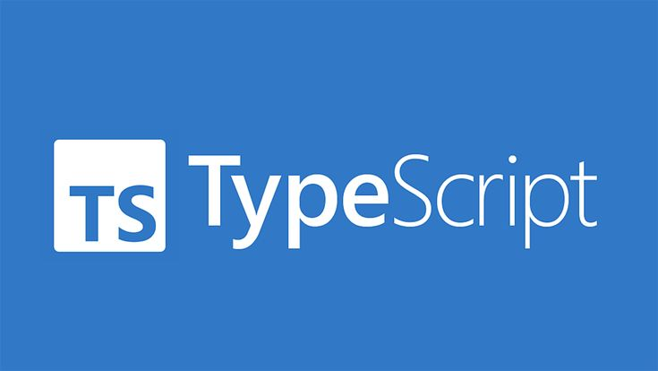

# 30 Days of Basics TypeScript

<div align="center"> 
  <h1>30 Days of Basics TypeScript: Introduction </h1>
</div>

<!-- Social links -->
[](htttps://discord.gg/Samson#0273) [](https://www.facebook.com/chiemezie.nebeolisa/) [](https://www.instagram.com/samson_nebeolisa/) [](https://www.linkedin.com/in/chiemezie-samson-nebeolisa-32897310b/) [](https://stackoverflow.com/users/20653301/nebeolisa-chiemezie-samson) [](https://twitter.com/SamsonChiemezie) [](https://myaccount.google.com/u/0/?utm_source=YouTubeWeb&tab=rk&utm_medium=act&tab=rk&hl=en) 

<!-- Portfolio -->
* 📰 About Me [Portfolio](https://www.nebe-samson.com/)

<div align="center"> 
  <small>Sep, 2024</small>
</div>


[Day 2 >>](../Day2_Types/Day2.md)



## Table of Contents

- [30 Days of Basics TypeScript](#30-days-of-typescript)
- [Introduction](#introduction)
  - [Key Features of TypeScript](#key-features-of-typescript)
  - [Prerequisites](#prerequisites)
- [Installing TypeScript](#installing-typescript)
  - [Install Node.js](#install-node.js)
  - [Installing Visual Studio Code](#installing-visual-studio-code)
  - [Getting Started with Visual Studio Code](#getting-started-with-visual-studio-code)
  - [Setting Up TypeScript in Your Project](#setting-up-typescript-in-your-project)
  - [Installing TypeScript](#installing-typescript)
  - [Setting Up TypeScript Configuration](#setting-up-typescript-configuration)
- [Setting Up TypeScript and Exploring Key Features](#setting-up-typescript-and-exploring-key-features)
  - [Create a TypeScript File](#create-a-typescript-file)
  - [Compile TypeScript to JavaScript](#compile-typescript-to-javascript)
  - [Automating TypeScript Compilation](#automating-typescript-compilation)
  - [Setting the Source Root](#setting-the-source-root)
  - [Including Files in Compilation](#including-files-in-compilation)
  - [Organizing JavaScript Output](#using-compiled-javascript-in-html)
  - [Using Compiled JavaScript in HTML](#organizing-javascript-output)
  - [Handling JavaScript-Like Code in TypeScript](#handling-javascript-like-code-in-typescript)
  - [Preventing Compilation on Error](#preventing-compilation-on-error)
  
# 📔 Day 1

Hello, I'm Samson Nebeolisa. In this course, I'll be guiding you through the fundamentals of TypeScript, helping you build a strong foundation in this powerful programming language. If you need any help or want to support others, feel free to join our [telegram group](https://t.me/ThirtyDaysOfJavaScript).

## Introduction

TypeScript was created by Microsoft, led by Anders Hejlsberg, who also created C#. It’s like an upgraded version of JavaScript that adds extra features to help you catch mistakes early and write cleaner code, especially in big projects.

For frontend developers like you, TypeScript can make a huge difference, especially when working with popular frameworks like Angular or React. TypeScript builds on JavaScript, which means any JavaScript code you write will work as TypeScript code, too. However, to use TypeScript in a browser or on a server like Node.js, you'll need to convert it into regular JavaScript.

The best part about TypeScript is its optional static typing. This means you can define what kind of data your code will use, which helps you find and fix errors before they become problems. In this course, I’ll walk you through the basics of TypeScript so you can build strong and efficient applications. Let’s get started and make your coding journey smoother and more effective!

### Key Features of TypeScript

  * Static Typing: TypeScript lets you specify what type of data your code should use, like numbers, strings, or booleans. This helps you catch mistakes before you even run your code, making it more reliable.

  * Modern JavaScript Features: TypeScript supports the latest JavaScript features, like classes, modules, and ```async/await```. It automatically converts these features so they work in older browsers that don’t support them.
  
  * Enhanced Tooling: TypeScript improves your coding experience with smart features like autocompletion, error checking, and better tools for refactoring your code. This makes coding faster and easier.

```typescript
function addNumbers(a: number, b: number): number {
  return a + b;
}

console.log(addNumbers(5, 10));  // Valid
console.log(addNumbers(5, "10"));  // Error: Argument of type 'string' is not assignable to parameter of type 'number'
```

### Prerequisites

Before we start this course, it’s important to have a good understanding of JavaScript. We won’t cover the basics of JavaScript in detail here, so make sure you’re comfortable with:

  * ES6 Features: Know how to use let and const, arrow functions, classes, modules, and template literals.

  * Functions and Closures: Understand how functions work in JavaScript and the concept of closures.

  * Asynchronous Programming: Be familiar with Promises, ```async/await```, and how the event loop works.

## Installing TypeScript

TypeScript works on all major operating systems, so whether you’re using Windows, macOS, or Linux, you can develop TypeScript applications. Microsoft even offers an online editor, so you don’t need to install anything if you prefer that option.

For this course, we'll be installing TypeScript on your local machine using ```Node.js``` and ```npm (Node Package Manager)```. Here’s how to do it step-by-step:

### Install Node.js 

TypeScript requires ```Node.js``` to be installed. You can download ```Node.js``` from [nodejs.org](https://nodejs.org/en/).


After downloading double click and install


To check if ```Node.js``` is installed on your computer, you can use your terminal or command prompt. Simply run the following command:

```terminal 
  node -v 
```
You might see an output like this:

```terminal 
  v20.16.0 
```

> [!NOTE]
> When I made this tutorial, I was using Node.js version v20.16.0 However, it's a good idea to use the most recent version for the best features and security updates.

### Installing Visual Studio Code

Visual Studio Code is a popular, free text editor that many developers use. I recommend [downloading Visual Studio Code](https://code.visualstudio.com/) if you haven’t already. However, if you prefer another text editor, that's perfectly fine—you can use what you’re comfortable with.


If you’ve installed Visual Studio Code, let’s dive in!

### Getting Started with Visual Studio Code

  1. Open Visual Studio Code: Double-click the icon on your desktop or find it in your applications menu.

  2. Explore the Interface: When you open Visual Studio Code, you’ll see a layout with different sections. Take some time to click on the icons and explore what each one does.

Feel free to interact with the icons labeled in the interface to get familiar with the editor.


### Setting Up TypeScript in Your Project

Once you’ve confirmed that Node.js is installed on your device, it’s time to set up your first project and integrate TypeScript.

 1. Create a Project Folder: 
    First, create a new folder on your device where you’ll keep your project files. Once created, open Visual Studio Code (VSCode) and import this folder.

  2. Create an HTML File:
    Inside this folder, create a simple HTML file named ```index.html```. You’ll use this later to run your project.

  3. Open the Terminal:
    In VSCode, open the terminal and ensure it's pointing to your current project folder (the folder you just created).

  4. Initialize Your Project with npm:
    To set up your project for managing dependencies, run the following command in the terminal:

    ```terminal
     npm init -y 
    ```

    This will create a ```package.json``` file in your folder, which is where you’ll store all your project’s dependencies and scripts.

### Installing TypeScript

Now that the project is set up, let’s install TypeScript. There are different ways to do this, but in this course, we’ll use npm (Node Package Manager) because it’s the most common method in JavaScript projects.

  1. Installing TypeScript Locally (Project-Level):
    Installing TypeScript locally means that it will only be available for this specific project. This is a good idea because different projects may need different versions of TypeScript. To install it locally, run:

    ```terminal 
      npm install typescript --save-dev
    ```
    This command installs TypeScript as a "dev dependency", which means it’s only needed during development and won’t be part of the final application when it runs.

  2. Installing TypeScript Globally (Machine-Level):
    If you plan to work on multiple TypeScript projects and don’t want to install it each time, you can install TypeScript globally on your machine. This makes it available for any project. To install globally, run:

    ```terminal 
      npm install -g typescript
    ```

After installation, make sure TypeScript is installed by running the following command:

```terminal
  tsc --version or tsc -v
```

Once TypeScript is installed, a few things will appear in your folder:

 - A ```node_modules``` folder (which stores all installed dependencies).
 - A ```package-lock.json``` file (used to lock the versions of your dependencies).
 - In your ```package.json``` file, you’ll see TypeScript listed under "devDependencies".

  ```package.json 
    "devDependencies": {
      "typescript": "^5.5.4"
    }
  ```

### Setting Up TypeScript Configuration

To use TypeScript properly, you need a configuration file (```tsconfig.json```) for your project. This file helps control how TypeScript compiles your code.

  1. Create the Config File: To generate a basic ```tsconfig.json``` file, run this command:

   ```terminal 
    npx tsc --init
   ```
  This will create a default ```tsconfig.json``` file in your project folder. The file contains several configuration options (many are commented out). You can edit this file to customize how TypeScript behaves in your project.

  ** What’s in ```tsconfig.json?``` **

    The ```tsconfig.json``` file is quite detailed, but don’t be intimidated. It allows you to control important things like:

    - Which files TypeScript should compile.
    - How strict the type-checking should be.
    - How the compiled JavaScript should look (ES5, ES6, etc.).
  
  Feel free to play around with the settings—many of the options are explained in comments inside the file itself.

## Setting Up TypeScript and Exploring Key Features

### Create a TypeScript File

let's start writing some TypeScript code.

  - First, inside your main project folder, create a new folder called "src". This will hold all your TypeScript files.
  - Inside the src folder, create a file called ```script.ts```.

Now, let's write a small TypeScript example in ```script.ts```:

```typescript
  const greeting33: string = "Hello, TypeScript!";
  console.log(greeting33);
```

### Compile TypeScript to JavaScript

To run the TypeScript file, we need to compile it into JavaScript.
 - Open your terminal and run the following command:

 ```terminal 
  tsc script.ts
 ```

This will generate a ```script.js``` file in the same folder. The TypeScript compiler has now converted your TypeScript code to JavaScript, which browsers can understand.

### Automating TypeScript Compilation

Typing ```tsc``` every time you make a change can get repetitive. Luckily, you can automate this!

  - Open your ```package.json``` file.
  - Under the ```"scripts"``` section, add the following line:

  ``` "start": "tsc --watch" ```

  ```package.json 
    "scripts": {
      "start": "tsc --watch",
      "test": "echo \"Error: no test specified\" && exit 1"
    },
  ```

What this does is run the TypeScript compiler (tsc) with the --watch flag, meaning the compiler will automatically recompile your files whenever you save a change. You won’t need to type the tsc command each time.

- Now, you can start the watch mode by running:

  ```terminal 
    npm start
  ```

This command will keep an eye on your files. Every time you edit your .ts files, TypeScript will automatically create the corresponding ```.js``` files.

### Setting the Source Root

To make sure TypeScript knows where to find your TypeScript files, set the root directory for your project. You can do this by updating the ```"rootDir"``` option in ```tsconfig.json```:

  ```json
    "rootDir": "./src"
  ```

This tells TypeScript to treat the ```src``` folder as the root for all your ```.ts``` files. However, typescript will still compile ```.ts``` files outside of this ```src``` folder.

### Including Files in Compilation

If you want to make sure TypeScript only compiles files from your ```src``` folder and ignores anything else, you can add an ```"include"``` option to your ```tsconfig.json```:

``` "include": ["src"] ```

```json
   {
      "compilerOptions": {
      ...
      }, 
      "include": ["src"]
    }
```

Now, TypeScript will only compile the ```.ts``` files inside the ```src``` folder, and output the ```.js``` files.

### Organizing JavaScript Output

By default, TypeScript compiles the ```.js``` file in the same directory where it exists. But it’s better to keep our compiled JavaScript files in a separate folder to avoid mixing TypeScript and JavaScript.

To do this, we’ll update the TypeScript configuration file (```tsconfig.json```).

  - Open your  ```tsconfig.json``` file.
  - Find the ```"outDir"``` option, uncomment it, and set it to a folder where you want the JavaScript files to go. For example:

  ```json
    "outDir": "./dest"
  ```
Now, your compiled JavaScript files will go into a new ```dest``` folder and you can delete the previous ```script.js``` file in the ```src``` folder.

###  Using Compiled JavaScript in HTML

Now that you have your script.js in the dest folder, let’s add it to an HTML file:

  - Create an index.html file (if you haven't already).
  - Link the compiled script.js in your HTML file like this:

  ```html 
    <script src="./dest/script.js"></script>
  ```

You can now open your index.html file in a browser and see the output from your TypeScript file in the console!

### Handling JavaScript-Like Code in TypeScript

Let's take a look at an example that would work fine in JavaScript but cause an error in TypeScript:

```typescript
  let a = 12;
  let b = "6";
  let c = 2;

  console.log(a / b);  // In JavaScript, this would return 2
  console.log(c * b);  // In JavaScript, this would return 12
```

In JavaScript, dividing or multiplying a number and a string that can be interpreted as a number is allowed. However, TypeScript will flag these operations as errors because ```t``` is a string, not a number:

> [!Error]
> The right-hand side of an arithmetic operation must be of type ```'any'```, ```'number'```, ```'bigint'```, or an ```enum``` type.

You can either fix this by explicitly changing ```t```from ```"6"``` to ```6```, or by casting it to a number, like so:

```typescript
  let t = Number("6");
```

### Preventing Compilation on Error

You can configure TypeScript to not compile files that contain errors. To do this:

 - In your ```tsconfig.json```, find ```"noEmitOnError"``` and set it to true:

  ```json
    "noEmitOnError": true
  ```

With this option enabled, TypeScript will stop generating JavaScript files if there are any errors in your code.

🌟 Awesome job! You’ve successfully completed your Day 1, and you're well on your way to becoming a great developer. Keep up the momentum! Now, let's keep your mind sharp and your body active with some quick exercises.

# 💻 Day 1: Exercises


🎉 CONGRATULATIONS ! 🎉

[Day 2 >>](../Day2_Types/Day2.md)