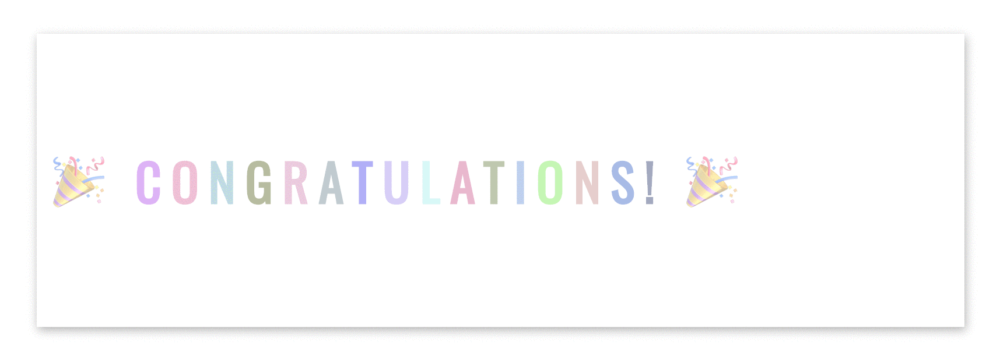

 
  <h1>20 Days of Basics TypeScript: Final Project</h1>

 

<!-- Social links -->
       

<!-- Portfolio -->
 📰 About Me [Portfolio](https://www.nebe-samson.com/)
  
  <small>Sep, 2024</small>

[<< Day 19](../Day19_Dom_Practice/Day19.md) 

 
  

## Table of Contents

- [📔 Day 20](#-day-20)
- [💻 Day 20: Exercises](#-day-20-exercises)
  - [Exercise: Level 1](#exercise-level-1)
  - [Exercise: Level 2](#exercise-level-2)

# 📔 Day 20

## 💻 Day 20: Exercises

### Exercise: Level 1

## Personal Portfolio Website:

 Build a portfolio website to showcase your projects, skills, resume, and experiences. You can use TypeScript to create interactive sections like project galleries, animations, and form submissions.

### Exercise: Level 2

🌕 Congratulations on completing your journey to greatness! You’ve reached a higher level than ever before. I know how much hard work it takes to get here, and you did it! You are a true hero. Now, it's time to celebrate your success—whether with a friend or family. I'm excited to see you in more of my future courses and continue this journey together!. Enjoy this moment—you’ve earned it! 🎉.

[<< Day 19](../Day19_Dom_Practice/Day19.md) 