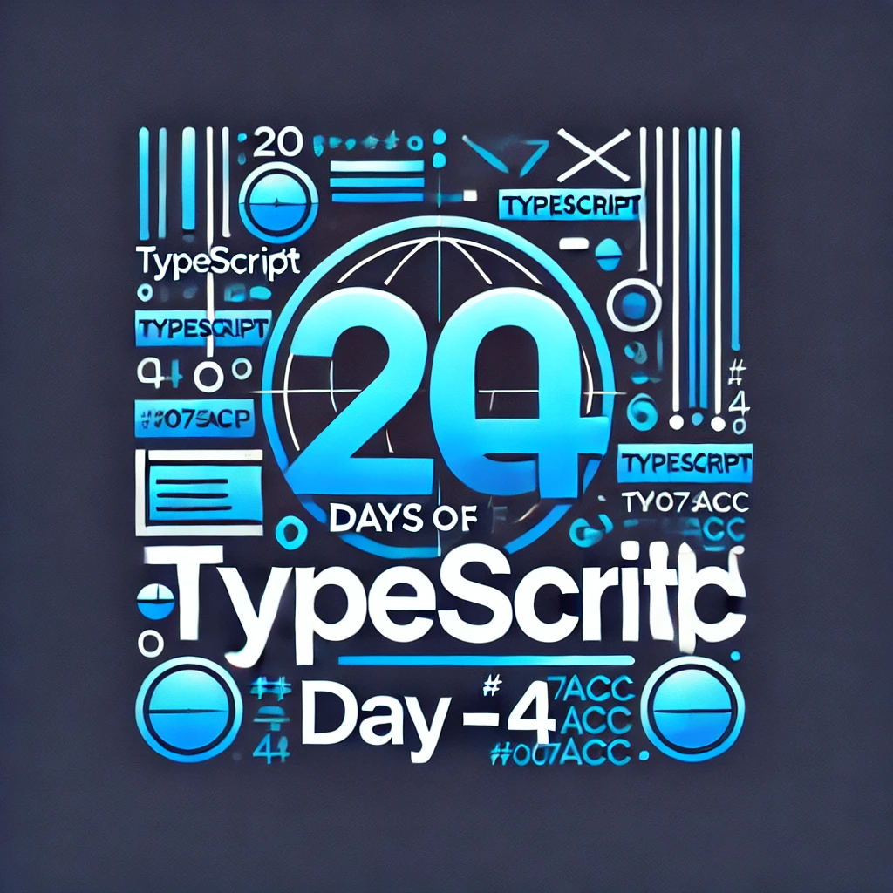

<div align="center"> 
  <h1>20 Days of Basics TypeScript: Tuples</h1>
</div>

<div align="center"> 

<!-- Social links -->
[](htttps://discord.gg/Samson#0273) [](https://www.facebook.com/chiemezie.nebeolisa/) [](https://www.instagram.com/samson_nebeolisa/) [](https://www.linkedin.com/in/chiemezie-samson-nebeolisa-32897310b/) [](https://stackoverflow.com/users/20653301/nebeolisa-chiemezie-samson) [](https://twitter.com/SamsonChiemezie) [](https://myaccount.google.com/u/0/?utm_source=YouTubeWeb&tab=rk&utm_medium=act&tab=rk&hl=en) 

<!-- Portfolio -->
 📰 About Me [Portfolio](https://www.nebe-samson.com/)
 <br/>
  <small>Sep, 2024</small>

  <p>
    <small>Support the <strong>author</strong> to create more educational materials</small>
     <br/>
     
  [](https://paypal.me/ChiemezieSamson?country.x=KR&locale.x=en_US)
  </p>
</div>

[<< Day 3](../Day3_Array_Type/Day3.md) | [Day 5 >>](../Day5_Objects/Day5.md)

<div align="center"> 
  <a class="header-image" target="_blank" href="../Asset/images/Days/Day_4.webp">
    
  </a>
</div>

## Table of Contents

- [📔 Day 4](#-day-4)
- [Tuple Types in TypeScript](#tuple-types-in-typescript)
  - [Tuples with Different Data Types](#tuples-with-different-data-types)
  - [Accessing and Modifying Tuple Elements](#accessing-and-modifying-tuple-elements)
  - [Optional Elements in Tuples](#optional-elements-in-tuples)
  - [Tuples in Functions](#tuples-in-functions)
  - [Tuples with Rest Elements](#tuples-with-rest-elements)
  - [Tuple with Rest Element in Function Parameters](#tuple-with-rest-element-in-function-parameters)
  - [Using TypeScript's Tuples and Interfaces](#using-typeScripts-tuples-and-interfaces)
  - [Readonly Tuples](#readonly-tuples)
  - [Real-World Use Case: HTTP Response Tuple](#real-world-use-case-http-response-tuple)
  - [When to Use Tuples vs. Arrays](#when-to-use-tuples-vs-arrays)
- [💻 Day 4: Exercises](#-day-4-exercises)
  - [Exercise: Level 1](#exercise-level-1)
  - [Exercise: Level 2](#exercise-level-2)
  - [Exercise: Level 3](#exercise-level-3)

# 📔 Day 4

## Tuple Types in TypeScript

A tuple is a special type of array where the number of elements and type of each element are known and fixed in advance. This allows us to create arrays with a strict order of types. Tuples are useful when you want to represent a group of elements where each element has a specific meaning and type. Unlike regular arrays, where each element can be any type, tuples enforce strict ordering and typing.

Let’s start with a simple example. Imagine you want to store a name (a string) and an age (a number). A tuple is perfect for this. 

```ts
  let myTuple: [string, number];

  myTuple = ["Samson", 30]; // This works fine
  myTuple = [30, "Samson"]; // ❌ Error: Type 'number' is not assignable to type 'string'
  myTuple = ["Samson", "30"]; // ❌ Error: Type 'string' is not assignable to type 'number'
```

Here, the tuple ```myTuple``` expects the first element to be a ```string``` and the second to be a ```number```. Switching the order or using a different type results in an error.

### Tuples with Different Data Types

You can define tuples with different types, and each position in the tuple has its specific type.

```ts
  // example 1
  let employee: [string, number, boolean];

  employee = ["Samson", 35, true]; // This is valid

  // example 2
  let labeledPoint: [string, number, number];

  labeledPoint = ["Point A", 10, 20]; // This is valid
```

### Accessing and Modifying Tuple Elements

Just like arrays, you can access tuple elements using their index. You can also modify them, as long as you respect their types.

```ts 
  // example 1
  let product: [string, number, boolean] = ["Laptop", 1500, true];

  console.log(product[0]); // Output: Laptop (string)
  console.log(product[1]); // Output: 1500 (number)
  console.log(product[2]); // Output: true (boolean)

  // you can also access the using Destructuring.
  let [name, price, isActive] = product;

  console.log(name); // Output: Laptop
  console.log(price); // Output: 1500
  console.log(isActive); // Output: true

  // example 2
  let coordinates: [number, number] = [50, 100];

  let x = coordinates[0]; // x = 50
  let y = coordinates[1]; // y = 100

  coordinates[0] = 75; // Changing the x-coordinate
```

### Optional Elements in Tuples

Tuples can also have optional elements, which makes them flexible for situations where certain data might not always be present. You can mark some tuple elements as optional by using the ```?``` symbol.

```ts 
  // example 1
  let optionalTuple: [string, number?];

  optionalTuple = ["John"]; // This works
  optionalTuple = ["John", 25]; // This also works

  // example 2
  let book: [string, string?, number?];

  book = ["The TypeScript Handbook"]; // Only title is provided
  book = ["The TypeScript Handbook", "John Doe", 2023]; // All values are provided

  console.log(book); // Output: ["The TypeScript Handbook", "John Doe", 2023]
```

### Tuples in Functions

Tuples can be used as parameters and return types in functions. This can be useful when you want to return multiple values from a function or accept a fixed set of typed values as input.

```ts 
  // Example 1: Tuple as a Function Parameter
  function tupleFunction(pair: [string, number]) {
    const name = pair[0]; // const name: string
    const age = pair[1];  // const age: number

    console.log(`Name: ${name}, Age: ${age}`);
  }

  tupleFunction(["Samson", 30]); // Valid
  // tupleFunction([30, "Samson"]); // ❌ Error: Type 'number' is not assignable to type 'string'

  // Example 2: Returning Tuples from a Function
  function getCoordinates(): [number, number] {
    return [100, 200];
  }

  // Using destructuring, we can easily extract the values from the tuple returned by the function.
  let [x, y] = getCoordinates();
  console.log(x, y); // Output: 100 200
```

### Tuples with Rest Elements

A tuple with a rest element allows you to define tuples with a fixed portion of elements followed by an indefinite number of elements of a specific type. This is useful when you want part of the tuple to be strictly typed and allow flexibility for the remaining elements.

The rest element is defined using the ```...``` (spread/rest operator) and can be used to capture any number of additional elements.

```ts 
  let tuple: [number, ...string[]];
```

The tuple starts with a ```number```, and the rest of the elements are of type ```string[]``` (an array of strings).

```ts
  // Example 1: If you want to start with two known values (a string and a number) but allow for additional boolean values.
  type StringNumberBooleans = [string, number, ...boolean[]];

  // Assigning values
  const tuple1: StringNumberBooleans = ["hello", 1];             // Works
  const tuple2: StringNumberBooleans = ["beautiful", 2, true];    // Works
  const tuple3: StringNumberBooleans = ["world", 3, true, false]; // Works

  // Example 2: This tuple has a number as the first element, and the rest can be any number of string elements.
  let data: [number, ...string[]];

  // Assigning values
  data = [1, "apple", "banana", "orange"];
  console.log(data); // Output: [1, 'apple', 'banana', 'orange']

  data = [2];
  console.log(data); // Output: [2]

  // Example 3: Tuples with rest elements and union types
  type EventData = [string, ... (string | number)[]];

  let event: EventData;

  // Assigning values
  event = ["UserClick", "Button", 3];
  console.log(event); // Output: ['UserClick', 'Button', 3]

  event = ["PageLoad", 200];
  console.log(event); // Output: ['PageLoad', 200]
```

>[!NOTE]
> A tuple with a rest element has no set ```“length”``` - it only has a set of well-known elements in different positions.

### Tuple with Rest Element in Function Parameters

Rest elements are particularly useful when passing tuples to functions. They allow functions to handle varying numbers of arguments while still enforcing types.

```ts 
  // example 1
  function logMessage(logLevel: [number, ...string[]]): void {
    const [level, ...messageParts] = logLevel;

    console.log(`Level ${level}:`, messageParts.join(" "));
  }

  logMessage([1, "System", "Error", "occurred"]);
  // Output: Level 1: System Error occurred

  logMessage([2, "User", "logged", "in"]);
  // Output: Level 2: User logged in

  // example 2
  function readButtonInput(...args: [string, number, ...boolean[]]) {
    const [name, version, ...inputs] = args;

    console.log(`Name: ${name}, Version: ${version}, Inputs: ${inputs}`);
  }

  readButtonInput("Button", 1, true, false, true);
  // Output: Name: Button, Version: 1, Inputs: [true, false, true]

  // same as the above function
  function readButtonInput(name: string, version: number, ...input: boolean[]) {
    // ...
  }
```

### Using TypeScript's Tuples and Interfaces

You can combine tuples and an interface to name the elements of a tuple-like structure. However, TypeScript tuples can only be accessed by index, so you need to create an interface to give names to the elements.

```ts
  // Define an interface for named properties
  interface Location {
    lat: number;
    long: number;
  }

  // Define the tuple type
  type LocationTuple = [number, number];

  // Combine the tuple with named properties
  const location: Location & LocationTuple = Object.assign([40.7144, -74.006], {
    lat: 40.7144,
    long: -74.006
  });

  // Access by index
  console.log(location[0]); // 40.7144

  // Access by name
  console.log(location.lat); // 40.7144
  console.log(location.long); // -74.006
```


### Readonly Tuples

Sometimes, you want to ensure that a tuple cannot be modified after it is created. In that case, you can use the ```readonly``` modifier.

```ts
  function tupleReadonly(pair: readonly [string, number]) {
    pair[0] = "hello!"; // ❌ Error: Cannot assign to '0' because it is a read-only property.
  }

  tupleReadonly(["Alice", 30]);
```

### Real-World Use Case: HTTP Response Tuple

A common use case for tuples is handling HTTP responses in a simple way, where the first element is the response status code and the second is the response data:

```ts
  type HttpResponse = [number, string];

  const response: HttpResponse = [200, "Success"];

  if (response[0] === 200) {
    console.log(`Response: ${response[1]}`); // Output: Response: Success
  }
```

### When to Use Tuples vs. Arrays

- Use Tuples when:

  - You need a fixed structure where the types and order of elements are known and meaningful.

  - You’re dealing with small, ordered data collections like coordinates ([x, y]), key-value pairs, or results like [error, result].

- Use Arrays when:

  - You have a collection of items that are all of the same type, like a list of numbers or strings.

  - The number of elements can vary.

🌟 Awesome job! You’ve successfully completed your Day 4, and you're well on your way to becoming a great developer. Keep up the momentum! Now, let's keep your mind sharp and your body active with some quick exercises.

## 💻 Day 4: Exercises

### Exercise: Level 1

1. Create a tuple that holds a ```string``` and a ```number```. Try the following:
    - Define a tuple with the values ```"Alice"``` and ```25```.
    - Swap the order of the values (e.g., ```25``` and ```"Alice"```) and observe the error.
    - What error do you get when you try to change the order?

2. You have the following tuple:

```ts
  let myTuple: [number, string] = [42, "TypeScript"];
```

  - Access the first element and assign it to a variable.
  - Change the first element to a different number.
  - Try changing the second element to a ```number```. What error do you get?

3. You have the following code:

```ts
  let myTuple = ["TypeScript", 2024];
```
  - What type is inferred for ```myTuple```? Is it considered a tuple or an array?
  - Manually define ```myTuple``` as a tuple of ```string``` and ```number```, ensure TypeScript enforces the correct types.
  - Can you add an extra element to the tuple using push? Why or why not?

### Exercise: Level 2

4. Write a function that returns a tuple of two numbers (representing coordinates). Then:

    - Use destructuring to assign the returned values to two variables.
    - Print the variables to the console.

5. You are tasked with defining a tuple that includes:

    - A `string` (name),
    - A `number` (age),
    - An optional `boolean` (isEmployed),
    - An arbitrary number of `string` values (skills).

    i. Define this tuple type.

    ii. Create a tuple with all the elements: `"Sam"`, `30`, `true`, followed by three skills: `"JavaScript"`, `"TypeScript"`, `"React"`.

    iii. Now, create a tuple with only the required elements (`name` and `age`) and no `isEmployed` or `skills`.

    iv. Can you still add skills to the tuple with no `isEmployed`? What does this tell you about the relationship between optional elements and rest elements?

6. You are given a function:

```ts 
  function processTuple(tuple: readonly [number, ...string[]]) {
    tuple[0] = 10; // Try modifying this line
  }
```

  - Why does this code throw an error?
  - Modify the function to only read from the tuple without trying to modify it.
  - Can you still append more elements to a tuple defined with rest elements if it is marked as `readonly`? Why or why not?

### Exercise: Level 3

7. Define a tuple for a coordinate system to represent 3D points with ```x```, ```y```, and ```z``` values as numbers. Then, write a function ```calculateDistance``` that takes this tuple and returns the distance from the origin ```(0, 0, 0)```.

```ts
  console.log(calculateDistance(point)); // Output: 7.0710678118654755
```

8. Create a type alias ```Command``` for a tuple that always starts with a ```string``` command name, followed by any number of parameters (either ```string``` or ```number```). Write a function ```executeCommand``` that takes a ```Command``` tuple and prints the command and its parameters.

```ts
  // Test the function
  executeCommand(["login", "user1", "password123"]);
  executeCommand(["setVolume", 75]);
```

9. Consider the following tuple:

```ts 
  let point: [number, number] = [10, 20];
```

  - Convert the tuple to an object type that represents a point with `x` and `y` properties.
  - Rewrite the original tuple to include an optional third element, `label: string`, and update the code to handle this new label correctly in any functions that process the tuple.

10. Write a generic function that accepts a tuple of any length and returns a new tuple where all the elements are converted to strings. Example:

```ts 
  convertToStrings([1, true, "hello"]) // Expected output: ["1", "true", "hello"]
```

  - Implement this generic function.
  - Test it with tuples of different lengths and types.
  - Can TypeScript infer the correct return type automatically when using this function? Explain how TypeScript handles tuple types in generics.

🎉 CONGRATULATIONS ! 🎉

[<< Day 3](../Day3_Array_Type/Day3.md) | [Day 5 >>](../Day5_Objects/Day5.md)
