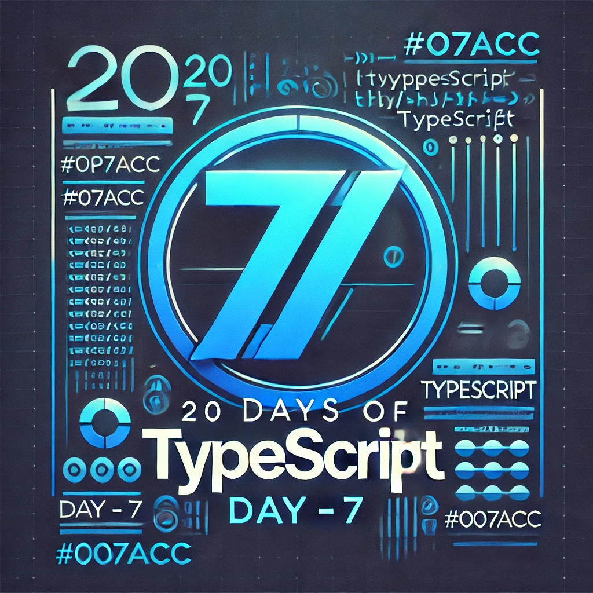

<div align="center"> 
  <h1>20 Days of Basics TypeScript: Functions 2</h1>
</div>

<div align="center"> 

<!-- Social links -->
[](htttps://discord.gg/Samson#0273) [](https://www.facebook.com/chiemezie.nebeolisa/) [](https://www.instagram.com/samson_nebeolisa/) [](https://www.linkedin.com/in/chiemezie-samson-nebeolisa-32897310b/) [](https://stackoverflow.com/users/20653301/nebeolisa-chiemezie-samson) [](https://twitter.com/SamsonChiemezie) [](https://myaccount.google.com/u/0/?utm_source=YouTubeWeb&tab=rk&utm_medium=act&tab=rk&hl=en) 

<!-- Portfolio -->
 📰 About Me [Portfolio](https://www.nebe-samson.com/)
 <br/>
  <small>Sep, 2024</small>
</div>

[<< Day 6](../Day6_Functions_1/Day6.md) | [Day 8 >>](../Day8_Narrowing/Day8.md)

<div align="center"> 
  <a class="header-image" target="_blank" href="../Asset/images/Days/Day_7.webp">
    
  </a>
</div>

## Table of Contents

- [📔 Day 7](#-day-7)
- [Functions in TypeScript](#functions-in-typescript)
- [Function Call Signatures in TypeScript](#function-call-signatures-in-typescript)
  - [Function Signatures with Optional and Default Parameters](#function-signatures-with-optional-and-default-parameters)
  - [Using Interfaces for Function Signatures](#using-interfaces-for-function-signatures)
  - [Functions Signatures with Rest Parameters](#functions-signatures-with-rest-parameters)
- [Function Overloads in TypeScript](#function-Ooverloads-in-typeScript)
  - [A Basic Overload Example](#a-basic-overload-example)
  - [Overloading with Different Parameter Types](#overloading-with-different-parameter-types)
- [Understanding `this` in TypeScript Functions](#understanding-this-in-typescript-functions)
  - [Declaring `this` in a Method](#declaring-this-in-a-method)
  - [Handling `this` in a Callback](#handling-this-in-a-callback)
  - [The Problem with Callbacks](#the-problem-with-callbacks)
  - [The Correct Way: Binding `this`](#the-correct-way-binding-this)
  - [Why Declaring `this` in TypeScript Matters](#why-declaring-this-in-typescript-matters)
- [💻 Day 7: Exercises](#-day-7-exercises)
  - [Exercise: Level 1](#exercise-level-1)
  - [Exercise: Level 2](#exercise-level-2)
  - [Exercise: Level 3](#exercise-level-3)


# 📔 Day 7

## Functions in TypeScript

## Function Call Signatures in TypeScript 

In TypeScript, function call signatures specify the blueprint of a function, detailing the types of its inputs (parameters) and its output (return value). By defining this structure, TypeScript ensures that functions are used in a predictable and type-safe manner, preventing common mistakes like passing incorrect argument types or receiving unexpected return values.

Call signatures are particularly useful when dealing with complex functions or higher-order functions—those that either accept other functions as arguments or return them. This approach enforces consistent behavior, making code easier to reason about and debug while ensuring that every function adheres to its expected role.

Here’s the basic syntax:

```ts
  (parameter1: Type1, parameter2: Type2) => ReturnType
```

Let’s start with a basic example: a function that adds two numbers.

```ts
  // Function declaration with types
  function addNumbers(a: number, b: number): number {
    return a + b;
  }
```

This function takes two parameters, both numbers, and returns their sum (also a number).

Now, we can create a call signature for this function. This allows us to define the "shape" of this function and reuse that shape elsewhere.

```ts
  // Call signature for add function
  type AddSignature = (a: number, b: number) => number;
  // This says: "We have a function that takes two number arguments and returns a number.

  // Using the call signature to define a function:
  const addFn: AddSignature = (x, y) => x + y;

  // same as the above
  const addFn: AddSignature = (x, y) => {
    return x + y;
  }

  console.log(addFn(5, 10)); // Output: 15
```

Now, addFn follows the AddSignature type, meaning it must accept two numbers and return a number. TypeScript will enforce this, ensuring we don’t accidentally break the function.

### Function Signatures with Optional and Default Parameters

Here’s a function that greets someone. It takes in their name, a greeting message (which defaults to "Hello"), and optionally, some punctuation.

```ts
  // Function with default and optional parameter
  function greet(name: string, greeting: string = "Hello", punctuation?: string): string {
    return `${greeting}, ${name}${punctuation || "!"}`;
  }

  // Call signature for the function
  type GreetSignature = (name: string, greeting?: string, punctuation?: string) => string;

  // Using the call signature
  const greetFn: GreetSignature = (name, greeting = "Hi", punctuation) => {
    return `${greeting}, ${name}${punctuation || "!"}`;
  };

  console.log(greetFn("Samson")); // Output: Hi, Samson!
  console.log(greetFn("Bob", "Good morning", ".")); // Output: Good morning, Bob.
```

### Using Interfaces for Function Signatures

In TypeScript, you can also define call signatures inside interfaces. This is especially useful in larger codebases or when working with classes.

```ts
  interface LogMessage {
    (message: string, level?: "info" | "error"): void;
  }
```

This interface defines a function that takes a `message` (string) and an optional `level` (either "info" or "error"). It doesn’t return anything (`void`).

Let’s implement a function that follows this interface:

```ts
  const logger: LogMessage = (msg, level = "info") => {
    console.log(`[${level.toUpperCase()}] ${msg}`);
  };

  logger("System started"); // Output: [INFO] System started
  logger("Something went wrong", "error"); // Output: [ERROR] Something went wrong
```

### Functions Signatures with Rest Parameters

Sometimes, you might not know in advance how many arguments your function will receive. For example, you might want to log multiple messages at once. You can use __rest parameters__ to handle this.

```ts
  // Function that takes any number of string arguments
  function logAll(...messages: string[]): void {
    messages.forEach((msg) => console.log(msg));
  }

  // Call signature for the function
  type LogAllSignature = (...messages: string[]) => void;

  // Using the call signature
  const logAllFn: LogAllSignature = (...msgs) => {
    msgs.forEach((msg) => console.log(msg));
  };

  logAllFn("Message 1", "Message 2", "Message 3"); 
  // Output: 
  // Message 1
  // Message 2
  // Message 3
```

## Function Overloads in TypeScript

In TypeScript, function overloads allow you to define different ways a function can be called, depending on the arguments provided. Think of them as multiple versions of the same function that handle different input types or parameters. TypeScript uses these overloads to determine the correct behavior when you call the function.

>[!TIP]
> If you're new to TypeScript or functions in general, you might want to stick to simpler functions first. Function overloads can get a little tricky to manage, but once you understand the concept, they become a powerful tool to handle different scenarios in one neat package.

Here’s why function overloads are useful:

- __Type Safety__: They make sure you’re using the right types when calling a function, which helps avoid errors.

- __Flexibility__: One function can handle different types of input or situations, making your code cleaner and more reusable.

### A Basic Overload Example

Let’s start with a simple example where we have a function that can either take a string or an array, and we want to return the length of that input.

```ts
  // Function overload signatures
  // Here’s how you define two versions of the same function:
  function getLength(input: string): number;
  function getLength(input: any[]): number;

  // Function implementation
  // After defining the overloads, you write the actual function that handles both cases:
  function getLength(input: string | any[]): number {
      return input.length;
  }

  // Usage
  const stringLength = getLength("Hello, TypeScript!"); // Returns 18
  const arrayLength = getLength([1, 2, 3, 4]); // Returns 4
```

TypeScript automatically picks the right overload based on what you pass to the function.

### Overloading with Different Parameter Types

Let’s step it up a bit. Imagine you have a function that does two very different things depending on the input:

1. If you pass a string and a boolean, it formats the string as uppercase or lowercase.
2. If you pass a number and a precision, it formats the number to a specific number of decimal places.

```ts
  // Function overload signatures
  function format(input: string, uppercase: boolean): string;
  function format(input: number, precision: number): string;

  // Function implementation
  function format(input: string | number, arg2: boolean | number): string {
    if (typeof input === "string" && typeof arg2 === "boolean") {
        return arg2 ? input.toUpperCase() : input.toLowerCase();
    } else if (typeof input === "number" && typeof arg2 === "number") {
        return input.toFixed(arg2);
    } else {
        throw new Error("Invalid arguments");
    }
  }

  // Usage
  const formattedString = format("Hello", true); // Returns "HELLO"
  const formattedNumber = format(3.14159, 2); // Returns "3.14"
```

## Understanding `this` in TypeScript Functions 

In JavaScript, the `this` keyword can sometimes be tricky, and it behaves differently depending on how and where it's used. TypeScript makes it easier by allowing you to explicitly define the type of `this` in functions. This helps you avoid common mistakes and ensures that your functions behave as expected. In TypeScript, you can define the type of `this` in a function. This type declaration is used only for type checking and isn’t something you actually pass when calling the function.

### Declaring `this` in a Method

Let’s say you have an object representing a human, and you want a method to greet the user by their name. You can use this to refer to the object itself.

```ts
  interface Human {
    name: string;
    greet(this: Human): void;
  }

  const human: Human = {
    name: "Samson",
    greet(this: Human) {
      console.log(`Hello, my name is ${this.name}`);
    },
  };

  human.greet(); // Output: Hello, my name is Samson
```

By explicitly declaring the `this` type, TypeScript will throw an error if `greet` is ever called in a context where `this` is not a `Human`.

### Handling `this` in a Callback

Callbacks often present issues with `this` because when a function is passed as an argument to another function (like an event listener), the context of `this` can get lost. Let’s see how TypeScript helps us handle that.

Imagine you have a button handler that logs the button’s ID when clicked:

```ts
  interface Handler {
    element: HTMLElement;
    onClick(this: Handler, event: Event): void;
  }

  const buttonHandler: Handler = {
    element: document.getElementById("myButton") as HTMLElement,
    onClick(this: Handler, event: Event) {
      console.log(`Button clicked!`, this.element.id);
    },
  };
```

In the onClick method, we declare this: Handler to ensure that this inside the method refers to the Handler object.

### The Problem with Callbacks

If you try to attach this `onClick` function as a callback to an event listener like this:

```ts
  buttonHandler.element.addEventListener("click", buttonHandler.onClick); // ❌ Error in TypeScript
```

TypeScript will throw an error! Why? Because when you pass `buttonHandler.onClick` as a callback, the context of `this` gets lost, and `this` inside `onClick` won’t correctly point to `buttonHandler`.

### The Correct Way: Binding `this`

To ensure `this` inside `onClick` correctly refers to `buttonHandler`, you need to bind the function’s `this` context:

```ts
  buttonHandler.element.addEventListener("click", buttonHandler.onClick.bind(buttonHandler)); // No error
```

By using `.bind(buttonHandler)`, you tell TypeScript that `this` inside `onClick` should always refer to `buttonHandler`.

### Why Declaring `this` in TypeScript Matters

- __Prevents Mistakes__: It ensures `this` always refers to the correct object inside your function. If something is wrong, TypeScript will warn you before you run into unexpected behavior.

- __Type Safety__: TypeScript will check that you're using `this` correctly, helping you avoid bugs in your code.

- __Consistency__: By explicitly declaring the `this` type, you make sure that `this` works as expected across different parts of your application, especially in callbacks and event listeners.

🌟 Awesome job! You’ve successfully completed your Day 7, and you're well on your way to becoming a great developer. Keep up the momentum! Now, let's keep your mind sharp and your body active with some quick exercises.

## 💻 Day 7: Exercises

### Exercise: Level 1

1. Create a function `buildURL` that takes two parameters: `path` (a required string) and `query` (an optional string). If `query` is not provided, return just the `path`. Otherwise, return the `path` with the query string appended, separated by a `?`.

2. Define a function `repeatAction` that takes two parameters:

  - `times`: a number that indicates how many times to repeat an action.
  - `action`: a callback function that takes no parameters and returns `void`.

The `repeatAction` function should call the `action` the specified number of times.

3. Write a function `getUser` that returns an object with properties `name` and `age`. Use TypeScript’s return type inference to allow TypeScript to infer the return type automatically.

4. Create a function `formatDate` that can accept either a `Date` object or a string as input. If it’s a `Date` object, return a formatted date string (`YYYY-MM-DD`). If it’s a string, assume it’s a date string and return the same value unchanged.

### Exercise: Level 2

5. Create a function `parseData` that:

  - Returns an array of numbers if you pass it a string of comma-separated numbers (e.g., `"1,2,3"`).

  - Returns a string if you pass it an array of numbers (e.g., `[1, 2, 3]`).

Use function overloads to define these behaviors.

6. Write a generic function `filterArray` that accepts an array of any type and a callback function that takes an element of that type and returns a boolean. The `filterArray` function should return a new array that contains only the elements for which the callback returns `true`.

7. Create a recursive function `factorial` that takes a number as input and returns its factorial. Make sure to define the function with proper types in TypeScript.

### Exercise: Level 3

8. Write a higher-order function `withLogging` that takes a function `fn` as an argument and returns a new function. The new function should log the arguments passed to `fn` and the result returned by `fn` before returning the result itself. Make sure `fn` can be of any type, and use generics to ensure type safety.

9. Write a curried function `addThreeNumbers` that accepts three arguments: `a`, `b`, and `c`, one at a time, and returns the sum of these three numbers. Use TypeScript to define the types for each step of the function.

10. You are building a class `Timer` that tracks time. Implement the `start` and `stop` methods for the `Timer` class:

  - The `start` method should begin tracking the time.

  - The `stop` method should log the total time passed.

Use `this` to handle the internal state of the timer, and make sure TypeScript ensures the correct behavior of `this`.

🎉 CONGRATULATIONS ! 🎉

[<< Day 6](../Day6_Functions_1/Day6.md) | [Day 8 >>](../Day8_Narrowing/Day8.md)
